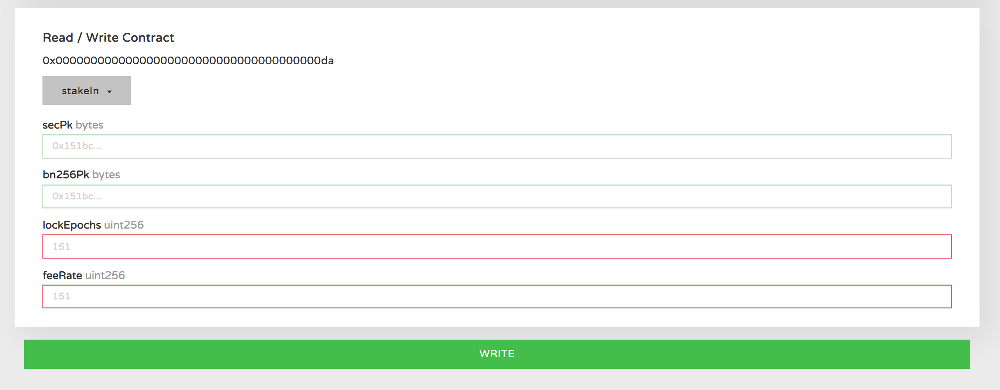

# Testnet Validator Node Setup

This is a guide for helping getting started as a Wanchain Galaxy Consensus validator node. There are two options for setting up a validator node. [Quick Start](staking/node-setup-testnet?id=quick-start-from-script), or [Extended Setup](staking/node-setup-testnet?id=extended-setup). We recommend users follow the Quick Start guide. Please join our [Gitter chat room](https://gitter.im/wandevs/community) for additional guidance. 

Check your validator node's status at: [http://testnet.wanscan.org/](http://testnet.wanscan.org/)

Check the network status at: [http://testnet.wanstats.io/](http://testnet.wanstats.io/)

 

**Setup**
- We recommend using Linux or MacOS
- A wallet with the WAN you wish to stake + a small amount of WAN for service fees.
- You may use a cloud server such as AWS or run on bare metal. See our [AWS getting started guide](staking/aws.md) for more information.
- If using AWS, we recommend AWS m4.xlarge with the following configuration
  - CPU: 4
  - RAM:16G
  - Disk 256G
- Open Firewall Ports 17717 for UDP/TCP
  
*For manual setup you also need:*
- [Docker](https://www.docker.com/)  
- Install Golang from https://golang.org/ and set GO environment variables `$GOPATH` and `$GOROOT` if you want to build from source code.

## Quick Setup

#### 1) Run a command to create and run validator

After ssh login into cloud server. Run this command below:

```bash
wget https://raw.githubusercontent.com/wanchain/go-wanchain/develop/loadScript/deployValidator.sh && chmod +x deployValidator.sh && ./deployValidator.sh
```

The script will prompt you to enter the name of the validator, which is used as the display name on the [wanstats website](http://testnet.wanstats.io/) and does not represent the name on the blockchain browser.

The script will prompt you to enter the password for the validator account.

After executing the script you should see three pieces of information that you need to save. That includes your validator public address, a pair of two validator public keys, and a JSON keystore. Keep all this information in a safe place.  

If you need to restart your node, please use the following script:

```
wget https://raw.githubusercontent.com/wanchain/go-wanchain/develop/loadScript/restartValidator.sh && chmod +x restartValidator.sh && ./restartValidator.sh
```

You can use the following command to see the validator logs (`Ctrl + c` to exit logs):

```
sudo docker logs -f gwan
```

#### 2) Register validator from wallet

Next, you can complete the validator registration behavior through the web based [WanWallet Desktop 1.5.7-beta](https://github.com/wanchain/wan-wallet-desktop/releases) or [MyWanWallet](https://mywanwallet.com/).

**WanWallet Desktop Steps:**


**MyWanWallet Steps**

When registering in MyWanWallet, make certain to select the 'WAN Testnet' network in the upper right corner.  

Click on the Contract page and select the Staking contract.

After selecting Access, select StakeIn.


Fill in all the empty fields. 

The `secPk` and `bn256Pk` are the two public keys returned after the script is executed. 

The `lockEpochs` is the lock time, which ranges from 7 to 90 (one epoch is approximately one day, the chance for earning rewards increases with the length of lock time). 

`feeRate` is the commission rate, which ranges from 0 to 10000, representing a commission rate of 0.00% to 100.00%.

After filling out all the fields, select your wallet type.

**!!!WARNING!!!**

Do not use your validator account to fund the staking contract! The best security practice is to fund the account from a separate account secured with a hardware or offline wallet. The account which you use to fund the validator node will also be used to perform all staking related operations.

**!!!WARNING!!!**

Then click 'Write' to begin the transaction.

[](/media/stake_register.png)

In the pop up window, in the 'Amount to Send' field, enter the amount of WAN you will stake in your validator node.

In the 'Gas Limit' field, enter the gas limit for your transaction (21000 is the default, you may need to increase if there is network congestion). 

Click 'Yes, I am sure!' to complete your transaction. You can check your transaction by searching for your validator's address at [http://testnet.wanscan.org/](http://testnet.wanscan.org/). Your node should currently display `Joining` status. After 1-2 epochs (1 epoch ~ 1 day), your node will join the consensus process. To have your node name and logo displayed on the Wanscan website, please get in touch at [techsupport@wanchain.org](techsupport@wanchain.org).

#### 3) Fund Validator Address With Gas Fees
The validator address must be funded with a small amount of WAN in order to pay network fees associated with the consensus process.

Fees are generally not more than 0.01 WAN per transaction, so a transfer of 50 wan to the validator account can support long term use.

Please check the balance of the validator address regularly through the [WanScan](http://testnet.wanscan.org/) to ensure that transaction fees are always available.

To update your validator display information on WanScan.org, fill in this [form](https://forms.office.com/Pages/ResponsePage.aspx?id=VPnN3XSIEEqLYwFUDjqIlhDN00eQ8opLu9Rbjur15g5UOTVCNFoxQ0dCRUNFTFQzTTVBVFFVMjI2OS4u)


## Extended Setup
*This method of setup is for advanced users. We recommend using the Quick Start guide above for most users.*

#### Step by step node setup

**Step 1:** Install docker (Ubuntu):
```bash
$ sudo wget -qO- https://get.docker.com/ | sh

$ sudo usermod -aG docker YourUserName

$ exit
```

**Step 2:** Start GWAN with Docker and create account:
```bash
$ docker pull wanchain/client-go:3.0.0-beta.12

$ docker run -d -v /home/YourUserName/.wanchain:/root/.wanchain wanchain/client-go:3.0.0-beta.12 /bin/gwan --testnet

YourContainerID

$ docker exec -it YourContainerID /bin/bash

root> gwan attach .wanchain/testnet/gwan.ipc

> personal.newAccount('YourPassword')

"YourAccountAddress"

> personal.showPublicKey("YourAccountAddress", 'YourPassword')

["YourPK1", "YourPK2"]

> exit

root> echo "YourPassword" > /root/.wanchain/pw.txt

root> exit

```


**Step 3:** Get test WAN for "YourAccountAddress":

Follow [6.3. Get test WAN](#63-get-test-wan) to get test WAN.

And after receiving test WAN, continue to step 4.

**Step 4:** Validator Registration

The validator registration can be done visually using the community-developed [mywanwallet] (https://mywanwallet.io/#contracts) web wallet. You can also use script registration as follows.

**!!!WARNING!!!**

In order to protect the security of the account, please do not enable the "--http" parameter when using script to register. Please verify before continue. (Recommended to use the GUI wallet for registration)

Create a script file in path: `/home/YourUserName/.wanchain/validatorRegister.js`

```javascript
// If you want to register to be a miner you can modify and use this script to run.


//-------INPUT PARAMS YOU SHOULD MODIFY TO YOURS--------------------

// tranValue is the value you want to stake in minValue is 10000 for non-delegate validator and 50000 for delegate validator 
var tranValue = "50000"

// gasValue is the value you send to miner for protocal run's gas usage.
var gasValue = 100

// validatorAddr is the validator accounts which create nearly.
var validatorAddr = ""

// secpub is the miner accounts's secpub value which is get by personal.showPublicKey
var secpub    = ""

// g1pub is the miner accounts's g1pub value which is get by personal.showPublicKey
var g1pub     = ""

// feeRate is the delegate dividend ratio if set to 10000, means it's a single miner do not accept delegate in.
// range 0 ~ 1000 ~ 10000 means 0% ~ 10.00% ~ 100.00%
var feeRate   = 1000

// lockTime do not use in POC
var lockTime  = 7

// baseAddr is the fund source account.
var baseAddr  = ""

// passwd is the fund source account password.
var passwd    = ""

//-------INPUT PARAMS YOU SHOULD MODIFY TO YOURS--------------------


//------------------RUN CODE DO NOT MODIFY------------------
personal.unlockAccount(baseAddr, passwd)
var pay = eth.sendTransaction({from:baseAddr, to:validatorAddr, value:web3.toWin(gasValue)})
var cscDefinition = [{"constant":false,"inputs":[{"name":"addr","type":"address"}],"name":"stakeAppend","outputs":[],"payable":true,"stateMutability":"payable","type":"function"},{"constant":false,"inputs":[{"name":"addr","type":"address"},{"name":"lockEpochs","type":"uint256"}],"name":"stakeUpdate","outputs":[],"payable":false,"stateMutability":"nonpayable","type":"function"},{"constant":false,"inputs":[{"name":"secPk","type":"bytes"},{"name":"bn256Pk","type":"bytes"},{"name":"lockEpochs","type":"uint256"},{"name":"feeRate","type":"uint256"}],"name":"stakeIn","outputs":[],"payable":true,"stateMutability":"payable","type":"function"},{"constant":false,"inputs":[{"name":"secPk","type":"bytes"},{"name":"bn256Pk","type":"bytes"},{"name":"lockEpochs","type":"uint256"},{"name":"feeRate","type":"uint256"},{"name":"maxFeeRate","type":"uint256"}],"name":"stakeRegister","outputs":[],"payable":true,"stateMutability":"payable","type":"function"},{"constant":false,"inputs":[{"name":"addr","type":"address"},{"name":"renewal","type":"bool"}],"name":"partnerIn","outputs":[],"payable":true,"stateMutability":"payable","type":"function"},{"constant":false,"inputs":[{"name":"delegateAddress","type":"address"}],"name":"delegateIn","outputs":[],"payable":true,"stateMutability":"payable","type":"function"},{"constant":false,"inputs":[{"name":"delegateAddress","type":"address"}],"name":"delegateOut","outputs":[],"payable":false,"stateMutability":"nonpayable","type":"function"},{"constant":false,"inputs":[{"name":"addr","type":"address"},{"name":"feeRate","type":"uint256"}],"name":"stakeUpdateFeeRate","outputs":[],"payable":false,"stateMutability":"nonpayable","type":"function"},{"anonymous":false,"inputs":[{"indexed":true,"name":"sender","type":"address"},{"indexed":true,"name":"posAddress","type":"address"},{"indexed":true,"name":"v","type":"uint256"},{"indexed":false,"name":"feeRate","type":"uint256"},{"indexed":false,"name":"lockEpoch","type":"uint256"},{"indexed":false,"name":"maxFeeRate","type":"uint256"}],"name":"stakeRegister","type":"event"},{"anonymous":false,"inputs":[{"indexed":true,"name":"sender","type":"address"},{"indexed":true,"name":"posAddress","type":"address"},{"indexed":true,"name":"v","type":"uint256"},{"indexed":false,"name":"feeRate","type":"uint256"},{"indexed":false,"name":"lockEpoch","type":"uint256"}],"name":"stakeIn","type":"event"},{"anonymous":false,"inputs":[{"indexed":true,"name":"sender","type":"address"},{"indexed":true,"name":"posAddress","type":"address"},{"indexed":true,"name":"v","type":"uint256"}],"name":"stakeAppend","type":"event"},{"anonymous":false,"inputs":[{"indexed":true,"name":"sender","type":"address"},{"indexed":true,"name":"posAddress","type":"address"},{"indexed":true,"name":"lockEpoch","type":"uint256"}],"name":"stakeUpdate","type":"event"},{"anonymous":false,"inputs":[{"indexed":true,"name":"sender","type":"address"},{"indexed":true,"name":"posAddress","type":"address"},{"indexed":true,"name":"v","type":"uint256"},{"indexed":false,"name":"renewal","type":"bool"}],"name":"partnerIn","type":"event"},{"anonymous":false,"inputs":[{"indexed":true,"name":"sender","type":"address"},{"indexed":true,"name":"posAddress","type":"address"},{"indexed":true,"name":"v","type":"uint256"}],"name":"delegateIn","type":"event"},{"anonymous":false,"inputs":[{"indexed":true,"name":"sender","type":"address"},{"indexed":true,"name":"posAddress","type":"address"}],"name":"delegateOut","type":"event"},{"anonymous":false,"inputs":[{"indexed":true,"name":"sender","type":"address"},{"indexed":true,"name":"posAddress","type":"address"},{"indexed":true,"name":"feeRate","type":"uint256"}],"name":"stakeUpdateFeeRate","type":"event"}]
var contractDef = eth.contract(cscDefinition);
var cscContractAddr = "0x00000000000000000000000000000000000000DA";
var coinContract = contractDef.at(cscContractAddr);

var payload = coinContract.stakeIn.getData(secpub, g1pub, lockTime, feeRate)
var tx = eth.sendTransaction({from:baseAddr, to:cscContractAddr, value:web3.toWin(tranValue), data:payload, gas: 200000, gasprice:'0x' + (200000000000).toString(16)});
console.log("tx=" + tx)
//------------------RUN CODE DO NOT MODIFY------------------

```


**Step 5:** Run the registration script in GWAN

If you have not closed the Docker script from **Step 2**, continue with the commands below, otherwise restart the Docker script.

```bash
$ docker exec -it YourContainerID /bin/gwan attach .wanchain/testnet/gwan.ipc

> loadScript("/root/.wanchain/validatorRegister.js")

> exit

$ docker stop YourContainerID

$ docker run -d -p 17717:17717 -p 17717:17717/udp -v /home/YourUserName/.wanchain:/root/.wanchain wanchain/client-go:3.0.0-beta.12 /bin/gwan --testnet --etherbase "YourAccountAddress" --unlock "YourAccountAddress" --password /root/.wanchain/pw.txt --mine --minerthreads=1 --ethstats your-node-name:admin@testnet.wanstats.io --syncmode=full --snapshot=false --gcmode=archive 

```

The "--wanstats your-node-name:admin@testnet.wanstats.io" part in parameters is for collection of statistics information of node's operational status and network status in the PoS Beta Testnet.

Please customize "your-node-name" part with the node name you prefer, i.e. "Community-WAN-node_EMEA1". Please avoid using characters other than alphanumeric, dash and underscore, for example do not use spaces in node name.

You can refer to THE [WanStats website](http://testnet.wanstats.io/) to check your node's status and network status. 

Setup is now complete, mining will begin as soon as syncing is finished.


## Node Type

You can run a node in two different modes, staking and non staking.

#### Non-staking node

```bash
$ gwan --testnet --syncmode "full"
```

#### Staking-node

In the following command, you should replace the `0x8d8e7c0813a51d3bd1d08246af2a8a7a57d8922e` with your own account address and replace the `/tmp/pw.txt` file with your own password file with your password string in it.

```bash
$ gwan --testnet --etherbase "0x8d8e7c0813a51d3bd1d08246af2a8a7a57d8922e" --unlock "0x8d8e7c0813a51d3bd1d08246af2a8a7a57d8922e" --password /tmp/pw.txt  --mine --minerthreads=1 --syncmode=full --snapshot=false --gcmode=archive 
```

## Common Operations (CLI)

#### 1) PoS account creation

Before you run a PoS node you should create an account.

```bash
$ gwan --testnet console --exec "personal.newAccount('Your Password')"

// Or run after ipc attach
$ personal.newAccount('Your Password')
```

You can see your address created and printed in the screen, then you can press `Ctrl+C` to exit.

You will get a keystore file with three crypto key words in your path `~/.wanchain/testnet/keystore/` in Ubuntu or `~/Library/Wanchain/testnet/keystore/` in Mac OS.

And you can use a command to get the `Address Public Key` and `G1 Public Key` of your account.

```bash
$ gwan --testnet console --exec "personal.showPublicKey('Your Address', 'Your Password')"

// Or run after ipc attach
$ personal.showPublicKey('Your Address', 'Your Password')
```

These public keys will be used in staking registration.

#### 2) Check balance

You can check your balance in the address when you attach a GWAN console in the `ipc` file or use a console mode at GWAN start.

```bash
// In ubuntu
$ gwan attach ~/.wanchain/testnet/gwan.ipc

// In MacOS
$ gwan attach ~/Library/Wanchain/testnet/gwan.ipc

```

After the node synchronization is finished you can check your balance using the following command.

```bash
$ eth.getBalance("Your Address Fill Here")

// Such as address example shown above.
$ eth.getBalance("0x8c35B69AC00EC3dA29a84C40842dfdD594Bf5d27")
```

#### 3) Registration and delegation

If you have an account with WAN coins and you want to create a Galaxy Consensus validator, you should do it as in the diagram below:


You can register as a staking node through Stake register.

We have given a smart contract for registration and unregistration.

The contract interface is shown below.
```javascript
var cscDefinition = [{"constant":false,"inputs":[{"name":"addr","type":"address"}],"name":"stakeAppend","outputs":[],"payable":true,"stateMutability":"payable","type":"function"},{"constant":false,"inputs":[{"name":"addr","type":"address"},{"name":"lockEpochs","type":"uint256"}],"name":"stakeUpdate","outputs":[],"payable":false,"stateMutability":"nonpayable","type":"function"},{"constant":false,"inputs":[{"name":"secPk","type":"bytes"},{"name":"bn256Pk","type":"bytes"},{"name":"lockEpochs","type":"uint256"},{"name":"feeRate","type":"uint256"}],"name":"stakeIn","outputs":[],"payable":true,"stateMutability":"payable","type":"function"},{"constant":false,"inputs":[{"name":"secPk","type":"bytes"},{"name":"bn256Pk","type":"bytes"},{"name":"lockEpochs","type":"uint256"},{"name":"feeRate","type":"uint256"},{"name":"maxFeeRate","type":"uint256"}],"name":"stakeRegister","outputs":[],"payable":true,"stateMutability":"payable","type":"function"},{"constant":false,"inputs":[{"name":"addr","type":"address"},{"name":"renewal","type":"bool"}],"name":"partnerIn","outputs":[],"payable":true,"stateMutability":"payable","type":"function"},{"constant":false,"inputs":[{"name":"delegateAddress","type":"address"}],"name":"delegateIn","outputs":[],"payable":true,"stateMutability":"payable","type":"function"},{"constant":false,"inputs":[{"name":"delegateAddress","type":"address"}],"name":"delegateOut","outputs":[],"payable":false,"stateMutability":"nonpayable","type":"function"},{"constant":false,"inputs":[{"name":"addr","type":"address"},{"name":"feeRate","type":"uint256"}],"name":"stakeUpdateFeeRate","outputs":[],"payable":false,"stateMutability":"nonpayable","type":"function"},{"anonymous":false,"inputs":[{"indexed":true,"name":"sender","type":"address"},{"indexed":true,"name":"posAddress","type":"address"},{"indexed":true,"name":"v","type":"uint256"},{"indexed":false,"name":"feeRate","type":"uint256"},{"indexed":false,"name":"lockEpoch","type":"uint256"},{"indexed":false,"name":"maxFeeRate","type":"uint256"}],"name":"stakeRegister","type":"event"},{"anonymous":false,"inputs":[{"indexed":true,"name":"sender","type":"address"},{"indexed":true,"name":"posAddress","type":"address"},{"indexed":true,"name":"v","type":"uint256"},{"indexed":false,"name":"feeRate","type":"uint256"},{"indexed":false,"name":"lockEpoch","type":"uint256"}],"name":"stakeIn","type":"event"},{"anonymous":false,"inputs":[{"indexed":true,"name":"sender","type":"address"},{"indexed":true,"name":"posAddress","type":"address"},{"indexed":true,"name":"v","type":"uint256"}],"name":"stakeAppend","type":"event"},{"anonymous":false,"inputs":[{"indexed":true,"name":"sender","type":"address"},{"indexed":true,"name":"posAddress","type":"address"},{"indexed":true,"name":"lockEpoch","type":"uint256"}],"name":"stakeUpdate","type":"event"},{"anonymous":false,"inputs":[{"indexed":true,"name":"sender","type":"address"},{"indexed":true,"name":"posAddress","type":"address"},{"indexed":true,"name":"v","type":"uint256"},{"indexed":false,"name":"renewal","type":"bool"}],"name":"partnerIn","type":"event"},{"anonymous":false,"inputs":[{"indexed":true,"name":"sender","type":"address"},{"indexed":true,"name":"posAddress","type":"address"},{"indexed":true,"name":"v","type":"uint256"}],"name":"delegateIn","type":"event"},{"anonymous":false,"inputs":[{"indexed":true,"name":"sender","type":"address"},{"indexed":true,"name":"posAddress","type":"address"}],"name":"delegateOut","type":"event"},{"anonymous":false,"inputs":[{"indexed":true,"name":"sender","type":"address"},{"indexed":true,"name":"posAddress","type":"address"},{"indexed":true,"name":"feeRate","type":"uint256"}],"name":"stakeUpdateFeeRate","type":"event"}]
```

In the smart contract input parameters, the `feeRate` indicates the percentage of reward kept by the validator from the delegators' reward. 10000 indicates that the validator does not accept delegations. 

If you want to be an delegator and accept delegations from others, you need to set a reasonable percentage for your `feeRate` to attract others to invest.

The `feeRate`'s value ranges from 0 to 10000 and indicates the amount of reward kept by the validator (1000 means the validator will take a 10% fee, and the delegator will keep 90% of the reward).

You can register your stake with a custom script or just modify the module's script in `loadScript/validatorRegister.js`.

The JavaScript file `loadScript/register.js` is used by validators for registration, and `loadScript/sendDelegate.js` is used by test WAN holders for sending their delegation.

In the script file, the password should be replaced with your own in `personal.unlockAccount`.

`secpub`, `secAddr`, `g1pub` should be filled with your account's address public key, account address, and G1 public key. These public keys can be found using the function `personal.showPublicKey` shown above.

`lockTime` should be filled with the stake locking time. The unit of time is epoch. Epoch time is equal to SlotTime * SlotCount. 

The `tranValue` should be filled with the amount of WAN you want to lock in the smart contract for stake registration. You can't get it back until the locking time is up.

#### 5) Check rewards

You can check your balance as shown above to verify whether you have received a reward, and you can use the commands shown below to see which address was awarded and the reward amount for the specified epoch ID.

```bash
// In an attached IPC session to run for epoch 19000.
$ pos.getEpochIncentivePayDetail(19000)
```

#### 6) Unregister and Unlock

Validators can use [`stakeUpdate.js`](https://github.com/wanchain/go-wanchain/blob/develop/loadScript/stakeUpdate.js) to set lock time to 0. It will be un-register at next period. 

Delegators can use Wan wallet to delegate In or delegate Out.

## Common Operations (Web)

Various common staking operations may be accessed from the [MyWanWallet](https://mywanwallet.io) web wallet. 

Make certain to select the 'WAN Testnet' network in the upper right corner.  

Click on the 'Contracts' page and select the 'Staking' contract from the 'Select Existing Contract' drop down menu.

Click 'Select a function' to see the available functions.


`stakeIn` is the function used above to register as a validator and fund the intial stake on the network.



`stakeUpdate` is used to modify the length of the staking period. Validator nodes are set to auto renew at the end of each staking period for the same amount of time as the initial `lockEpochs` time specified when registering. In order to end staking and withdraw funds at the end of a staking period, the validator should use `stakeUpdate` to set the `lockEpochs` time to 0. This will be effective at the end of the current staking period. 


`stakeAppend` is used to add additional stake to the validator node. Validators may add stake at any time, but may not reduce stake during their staking period. 


`delegateIn` is a function available to normal WAN holders who wish to delegate to a validator through the web wallet interface. This function is available through the official WAN wallet, this is simply another option for users.


`delegateOut` is a function available to normal WAN holders who wish to withdraw their delegation from a validator node. They may withdraw at any time, although there will be a withdrawal period of several epochs before their funds will be unlocked. 


