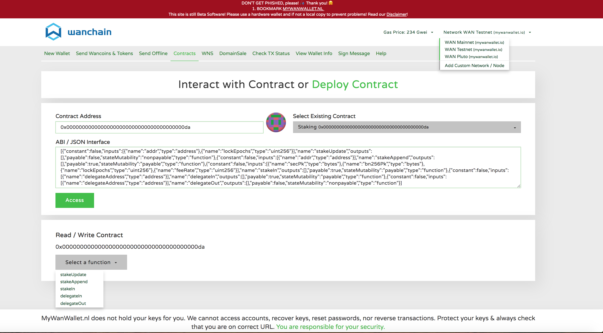
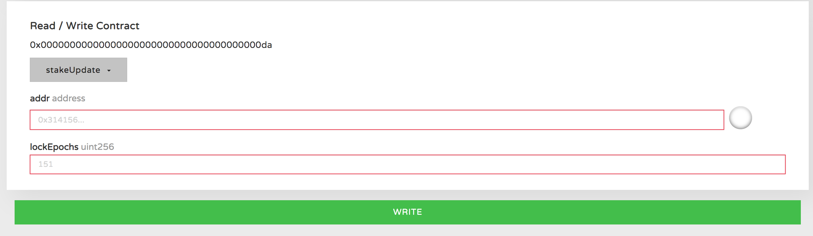
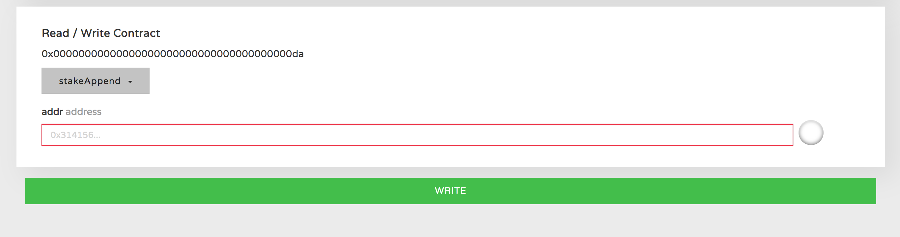
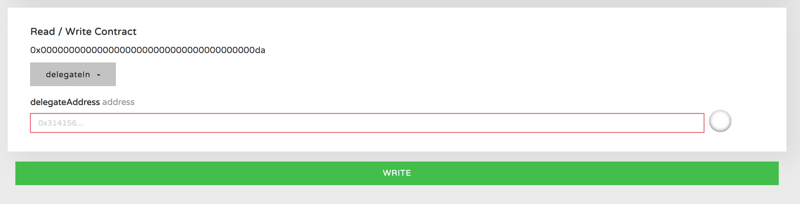
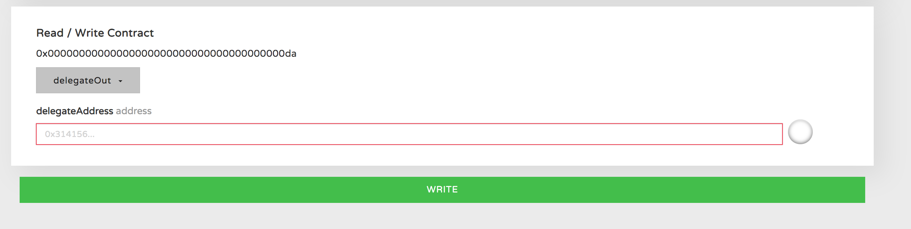

## Common Operations (CLI)

#### 1) PoS account creation

Before you run a PoS node you should create an account.

```bash
$ gwan console --exec "personal.newAccount('Your Password')"

// Or run after ipc attach
$ personal.newAccount('Your Password')
```

You can see your address created and printed in the screen, then you can press `Ctrl+C` to exit.

You will get a keystore file with three crypto key words in your path `~/.wanchain/keystore/` in Ubuntu or `~/Library/Wanchain/keystore/` in Mac OS.

And you can use a command to get the `Address Public Key` and `G1 Public Key` of your account.

```bash
$ gwan console --exec "personal.showPublicKey('Your Address', 'Your Password')"

// Or run after ipc attach
$ personal.showPublicKey('Your Address', 'Your Password')
```

These public keys will be used in staking registration.

#### 2) Check balance

You can check your balance in the address when you attach a GWAN console in the `ipc` file or use a console mode at GWAN start.

```bash
// In ubuntu
$ gwan attach ~/.wanchain/gwan.ipc

// In MacOS
$ gwan attach ~/Library/Wanchain/gwan.ipc

```

After the node synchronization is finished you can check your balance using the following command.

```bash
$ eth.getBalance("Your Address Fill Here")

// Such as address example shown above.
$ eth.getBalance("0x8c35B69AC00EC3dA29a84C40842dfdD594Bf5d27")
```

#### 3) Registration and delegation

If you have an account with WAN coins and you want to create a Galaxy Consensus validator, you should do it as in the diagram below:


You can register as a staking node through Stake register.

We have given a smart contract for registration and unregistration.

The contract interface is shown below.
```javascript
var cscDefinition = [{"constant":false,"inputs":[{"name":"addr","type":"address"}],"name":"stakeAppend","outputs":[],"payable":true,"stateMutability":"payable","type":"function"},{"constant":false,"inputs":[{"name":"addr","type":"address"},{"name":"lockEpochs","type":"uint256"}],"name":"stakeUpdate","outputs":[],"payable":false,"stateMutability":"nonpayable","type":"function"},{"constant":false,"inputs":[{"name":"secPk","type":"bytes"},{"name":"bn256Pk","type":"bytes"},{"name":"lockEpochs","type":"uint256"},{"name":"feeRate","type":"uint256"}],"name":"stakeIn","outputs":[],"payable":true,"stateMutability":"payable","type":"function"},{"constant":false,"inputs":[{"name":"secPk","type":"bytes"},{"name":"bn256Pk","type":"bytes"},{"name":"lockEpochs","type":"uint256"},{"name":"feeRate","type":"uint256"},{"name":"maxFeeRate","type":"uint256"}],"name":"stakeRegister","outputs":[],"payable":true,"stateMutability":"payable","type":"function"},{"constant":false,"inputs":[{"name":"addr","type":"address"},{"name":"renewal","type":"bool"}],"name":"partnerIn","outputs":[],"payable":true,"stateMutability":"payable","type":"function"},{"constant":false,"inputs":[{"name":"delegateAddress","type":"address"}],"name":"delegateIn","outputs":[],"payable":true,"stateMutability":"payable","type":"function"},{"constant":false,"inputs":[{"name":"delegateAddress","type":"address"}],"name":"delegateOut","outputs":[],"payable":false,"stateMutability":"nonpayable","type":"function"},{"constant":false,"inputs":[{"name":"addr","type":"address"},{"name":"feeRate","type":"uint256"}],"name":"stakeUpdateFeeRate","outputs":[],"payable":false,"stateMutability":"nonpayable","type":"function"},{"anonymous":false,"inputs":[{"indexed":true,"name":"sender","type":"address"},{"indexed":true,"name":"posAddress","type":"address"},{"indexed":true,"name":"v","type":"uint256"},{"indexed":false,"name":"feeRate","type":"uint256"},{"indexed":false,"name":"lockEpoch","type":"uint256"},{"indexed":false,"name":"maxFeeRate","type":"uint256"}],"name":"stakeRegister","type":"event"},{"anonymous":false,"inputs":[{"indexed":true,"name":"sender","type":"address"},{"indexed":true,"name":"posAddress","type":"address"},{"indexed":true,"name":"v","type":"uint256"},{"indexed":false,"name":"feeRate","type":"uint256"},{"indexed":false,"name":"lockEpoch","type":"uint256"}],"name":"stakeIn","type":"event"},{"anonymous":false,"inputs":[{"indexed":true,"name":"sender","type":"address"},{"indexed":true,"name":"posAddress","type":"address"},{"indexed":true,"name":"v","type":"uint256"}],"name":"stakeAppend","type":"event"},{"anonymous":false,"inputs":[{"indexed":true,"name":"sender","type":"address"},{"indexed":true,"name":"posAddress","type":"address"},{"indexed":true,"name":"lockEpoch","type":"uint256"}],"name":"stakeUpdate","type":"event"},{"anonymous":false,"inputs":[{"indexed":true,"name":"sender","type":"address"},{"indexed":true,"name":"posAddress","type":"address"},{"indexed":true,"name":"v","type":"uint256"},{"indexed":false,"name":"renewal","type":"bool"}],"name":"partnerIn","type":"event"},{"anonymous":false,"inputs":[{"indexed":true,"name":"sender","type":"address"},{"indexed":true,"name":"posAddress","type":"address"},{"indexed":true,"name":"v","type":"uint256"}],"name":"delegateIn","type":"event"},{"anonymous":false,"inputs":[{"indexed":true,"name":"sender","type":"address"},{"indexed":true,"name":"posAddress","type":"address"}],"name":"delegateOut","type":"event"},{"anonymous":false,"inputs":[{"indexed":true,"name":"sender","type":"address"},{"indexed":true,"name":"posAddress","type":"address"},{"indexed":true,"name":"feeRate","type":"uint256"}],"name":"stakeUpdateFeeRate","type":"event"}];
```

In the smart contract input parameters, the `feeRate` indicates the percentage of reward kept by the validator from the delegators' reward. 10000 indicates that the validator does not accept delegations. 

If you want to be an delegator and accept delegations from others, you need to set a reasonable percentage for your `feeRate` to attract others to invest.

The `feeRate`'s value ranges from 0 to 10000 and indicates the amount of reward kept by the validator (1000 means the validator will take a 10% fee, and the delegator will keep 90% of the reward).

You can register your stake with a custom script or just modify the module's script in `loadScript/validatorRegister.js`.

The JavaScript file `loadScript/register.js` is used by validators for registration, and `loadScript/sendDelegate.js` is used by test WAN holders for sending their delegation.

In the script file, the password should be replaced with your own in `personal.unlockAccount`.

`secpub`, `secAddr`, `g1pub` should be filled with your account's address public key, account address, and G1 public key. These public keys can be found using the function `personal.showPublicKey` shown above.

`lockTime` should be filled with the stake locking time. The unit of time is epoch. Epoch time is equal to SlotTime * SlotCount. 

The `tranValue` should be filled with the amount of WAN you want to lock in the smart contract for stake registration. You can't get it back until the locking time is up.

#### 5) Check rewards

You can check your balance as shown above to verify whether you have received a reward, and you can use the commands shown below to see which address was awarded and the reward amount for the specified epoch ID.

```bash
// In an attached IPC session to run for epoch 19000.
$ pos.getEpochIncentivePayDetail(19000)
```

#### 6) Unregister and Unlock

Validators can use [`stakeUpdate.js`](https://github.com/wanchain/go-wanchain/blob/develop/loadScript/stakeUpdate.js) to set lock time to 0. It will be un-register at next period. 

Delegators can use Wan wallet to delegate In or delegate Out.

## Common Operations (Web)

Various common staking operations may be accessed from the [MyWanWallet](https://mywanwallet.io) web wallet. 

Make certain to select the 'Mainnet' network in the upper right corner.  

Click on the 'Contracts' page and select the 'Staking' contract from the 'Select Existing Contract' drop down menu.

Click 'Select a function' to see the available functions.



`stakeIn` is the function used above to register as a validator and fund the intial stake on the network.


`stakeUpdate` is used to modify the length of the staking period. Validator nodes are set to auto renew at the end of each staking period for the same amount of time as the initial `lockEpochs` time specified when registering. In order to end staking and withdraw funds at the end of a staking period, the validator should use `stakeUpdate` to set the `lockEpochs` time to 0. This will be effective at the end of the current staking period. 



`stakeAppend` is used to add additional stake to the validator node. Validators may add stake at any time, but may not reduce stake during their staking period. 



`delegateIn` is a function available to normal WAN holders who wish to delegate to a validator through the web wallet interface. This function is available through the official WAN wallet, this is simply another option for users.



`delegateOut` is a function available to normal WAN holders who wish to withdraw their delegation from a validator node. They may withdraw at any time, although there will be a withdrawal period of several epochs before their funds will be unlocked. 


