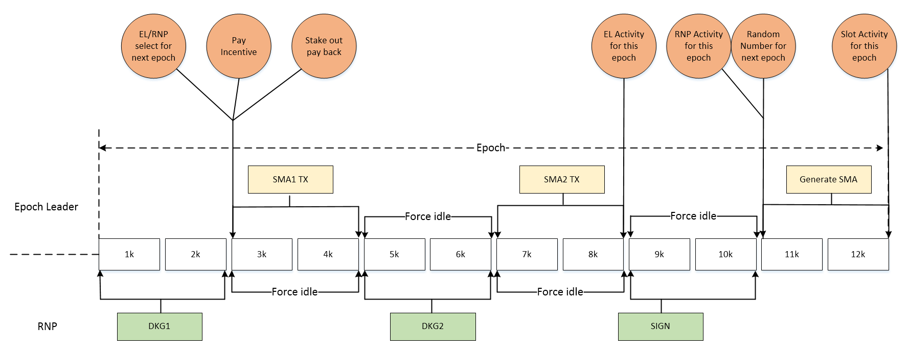

# Important Terms and Parameter

## Terms
The Wanchain PoS Consensus [research paper](https://www.wanchain.org/files/Wanchain-Galaxy-Consensus-V1.0.pdf) contains an in depth explanation of Galaxy consensus. Below is a simplified summary of important terms from the paper. Refer to the original paper for more detailed explanations:

**Wancoin (WAN)** — The Wancoin is the native currency staked by Validator nodes to secure and run Wanchain’s network. Validator nodes will gain “Staking Power” (see below) in Wanchain’s Proof of Stake consensus by staking more WAN and by committing to a longer period of staking. In return for Validators and Delegators staking in Wanchain’s network, both groups will be rewarded with Wancoins when their node is selected to produce a given set of blocks in an epoch (see “epoch” below). Validators and Delegators are also rewarded with transaction fees during the epoch, as the Wancoin is also used for network transaction fees in decentralized applications and cross-blockchain transactions.

**Validators** — Validators on the Wanchain network secure the network by playing one of two roles (see RNP and EL below) in the process of proposing, validating, and finalizing blocks. Validators can take two forms in the Galaxy consensus, either taking delegation or being a non-delegating node (below). An epoch lasts ~1 day, so there are approximately 30 epochs per month. To run a standard Validator node that can accept delegation, it will require a larger amount of WAN than it will to run a non-delegating validator.

**Delegators** — Delegators are anyone who delegates their stake to a Validator node. See [Partners > Staking](/community/partners?id=staking).

**Validator Delegate Ratio** — This is the ratio of stake between Validator and Delegators. Once the ratio has been reached, the Validator will need to increase their stake to make more room for additional delegation. For example, if the ratio is 1:10 and a validator has 100,000 WAN staked, then the validator may receive up to but no more than 1,000,000 WAN in delegations. 

**Non-Delegating Validators** — Non-delegating Validator nodes are nodes with a lower minimum WAN required and cannot accept delegation. There is no difference in how the two types of nodes participate in consensus, only in their ability to receive delegations. In order to become a Validator node, a larger amount of WAN must be staked by the node operator than the Non-Delegating node.

**Epoch** — An epoch is one protocol cycle, which is roughly one day in length. Nodes participating in the epoch (with each epoch having no more than 17280 blocks), will be rewarded for their contributions as Random Number Proposers or Epoch Leaders.

**Random Number Proposer (RNP)** — The RNP group is responsible for the critical work of jointly generating a random number for each block, to be used as an important seed for selecting which nodes make up the Epoch Leader groups to produce a given block. More technical detail in the Galaxy consensus research paper.

**Epoch Leader (EL)** — Similar to the RNP nodes, the Epoch Leader nodes are selected using the probability according to the proportion of each node’s Staking Power compared to all other nodes. The EL group is responsible for validating transactions and packaging them into blocks.

**Staking Power** — Staking Power, unique to Wanchain’s Galaxy consensus and referred to as wanstake in the research paper, is earned by Validators mainly by the amount of WAN staked in the node. However, there is also a time multiplier applied when Validators commit to a longer lock period for their node.

**Withdraw Delay** — Validators have a 1–2 day withdraw delay at the end of their staking period. Delegators can withdraw at any time, but there is a delay of approximately 3-4 days to avoid long range attacks.

**Commission Rate** — The commission rate is the fee charged by Validators for their service to delegators.  

## Parameters

| **Parameter**  |**Value**   | 
|:---|:---|
|Epoch Time| 24 Hours|
|Slots per epoch|17280|
| Delegating Node’s minimum staking amount  |  50,000 WAN | 
|  Non-delegating Node’s minimum staking amount | 10,000 WAN, cannot accept delegations| 
|  Validator Delegate Ratio | 1:10  |  
|  The number of validator nodes chosen to participate each epoch | 75, of which 49 are open to the public. The Foundation temporarily reserves 26 for network security at launch (the Foundation’s nodes operate normally but will not receive rewards, and will gradually be phased out.  |  
|  The maximum amount of stake for a single validator node | 10.5 million WAN. This value is the upper limit of the sum of the validator node’s own staking amount and the delegated amount received by the validator node.  |  
|  Lifetime network reward | 21,000,000 WAN is reserved by the Foundation as PoS reward; 2,500,000 WAN will be distributed in the first year, and will then decrease by 12% per year. |  
|  Validator node’s locking period | 7 to 90 epochs/days, and can be freely chosen between this range. After the locking period expires, the staked WAN will become available within one day.  |  
|  Delegators’ withdrawal delay | The withdrawal period for delegators is normally 3-4 days after they end delegation. Delegators may end delegation at any time, and may withdraw their funds after the withdrawal period. If delegation ends due to the validator's staking period finishing, then the withdrawal period for the delegator is only one day.|  

## Protocol Timeline

The protocol is divided into 6 distinct 4 hour stages, with important work happening throughout each stage. The stages are divided according to which role is performing work, the Epoch Leader (EL) or the Random Number Proposer (RNP). The EL role participates in three stages: SMA1, SMA2, and Generate SMA stages. The RNP role participates in three different stages: DKG1, DKG2, and SIGN stages. See detailed explanations [here](technology/galaxy-consensus).  

