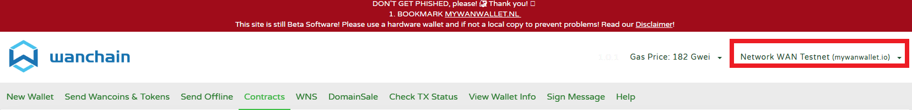
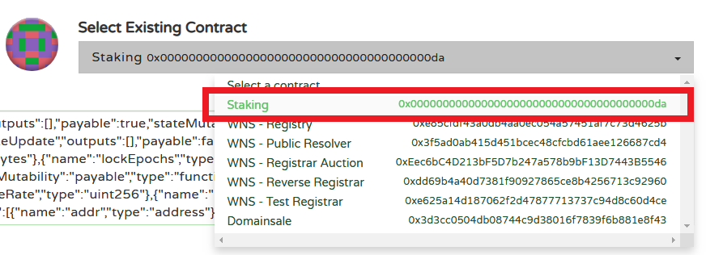
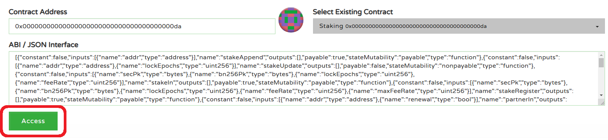
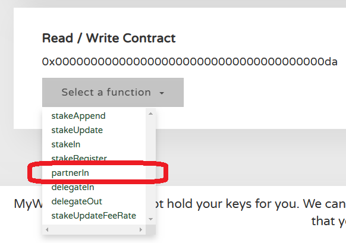
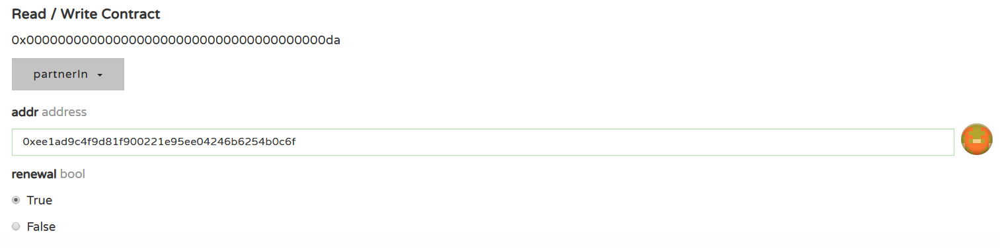
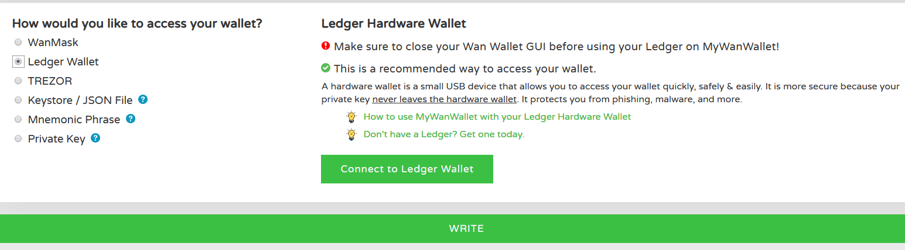

# Partner Model Staking Guide

Tutorial for validators’ registration in partner model 

### 1) Partner model main rules

1. Partner model has two roles: leader and partners;

1. The validator node’s PoS reward in the partner model is sent only to the leader's wallet address, therefore the distribution of PoS reward is “off-chain”;

1. The first person (Wanchain address) who registered the validator node is the leader, and Wanchain addresses other than the leader staking additional funds after the creation of the node, using partner model, are partners;

1. When the validator node no longer participates in the PoS consensus, the staking amount is returned automatically to the leader and partners’ respective wallet addresses, so there is no risk for partners to lose their staking amounts;

1. When the leader registers the validator node, the first staking amount must be no less than 10,000 WAN;

1. When partners inject funds into validator node using partner model, the first staking amount for each partner must be no less than 10,000 WAN, there is no minimum funding threshold when partners continue to inject funds after the first transaction;

1. Maximum number of partners for one single validator node is limited to 5. So maximum number of addresses injecting funds is 6, one leader plus 5 partners;

1. When the total staking amount of the leader and partners combined is less than 50,000 WAN, and the commission fee ratio is set to less than 100%, the validator node can not participate in the operation of the PoS protocol, thus will not receive PoS rewards;

1. Summary of partner model’s conditions: 
A) The validator node’s initial staking amount must be greater than 10,000 WAN, 
B) For each partner, initial staking amount must be greater than 10,000 WAN, 
C) When the commission fee ratio is set to less than 100% (“feeRate” value is set to less than 10000), the total staking amount of the leader and partners combined must be equal or higher than 50,000 WAN, otherwise validator node will not receive PoS rewards since it cannot participate in the PoS consensus.
D) When the commission fee ratio is set to 100% (“feeRate” value is set to 10000), the total staking amount of the leader and partners combined must be equal or higher than 10,000 WAN, but it is obvious that this requirement is always met since initial staking amount of leader must be greater than 10,000 WAN.

### 2) Partner model instructions for partners using Mywanwallet

1. Access https://mywanwallet.io/#contracts

1. Verify that you are using the correct network (Mainnet, testnet)

  

1. Select “Staking” smart contract in the drop-down list

  

1. Click “Access” button

  

1. Select “PartnerIn” function in the drop-down list

  

1. Enter validator node’s address, select whether to renew the staking period or not.

  

  If you choose “False” here in “renewal”, the staking amount will quit after the end of current lock period of the validator.
  For example, validator (leader) has set his “lockEpochs” value to be 30, which means the staking amount of leader will be locked for 30 epochs which equals roughly 30 days. And partner joined this node using partner model at day 10, and choose to not renew automatically, then this partner’s fund will be returned 20 days later (30 days – 10 days already passed).

1. Choose your wallet that will be used to inject funds accordingly 

  

Once Mywanwallet has gained access to your wallet, click “WRITE” to confirm the operation and inject funds into validator using partner model.