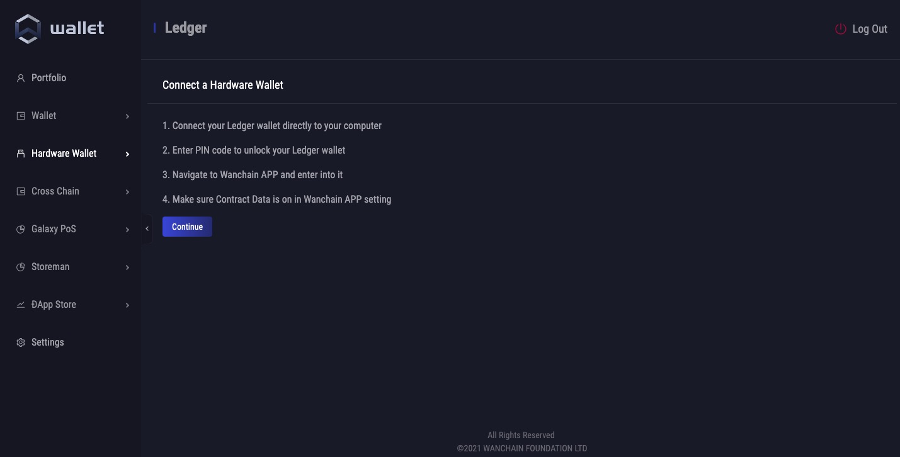

# Ledger Wallet User Guide for WAN

## Step by Step Guide

1. Install the Wanchain app via [Ledger Live](http://ledger.com/live).
2. Connect and unlock your Ledger Nano S.
3. If asked, allow the manager on your device by pressing the right button.
4. Find Ethereum in the app catalog, since the Wanchain app requires it.
5. Find Wanchain in the app catalog. (If you get an error message that the Bitcoin app is required, please install the Ethereum app. Ledger is working on fixing this.)

6. Click Install. An installation window will appear, your device will display “Processing...”, then the app installation will be confirmed.
7. Open WanDesktop Wallet. Go to **Hardware Wallet** -> **Ledger**. Then, following the instructions in the **Connect a Hardware Wallet** page.

a) Connect your Ledger wallet directly to your computer

b) Enter PIN code to unlock your Ledger wallet

c) Navigate to Wanchain APP and enter into it

d) Make sure **Contract Data** is on in Wanchain APP Settings is **allowed**.

8. Click **Continue**.
9. Select a WAN address in the pop-up window, and click **OK**.
10. Up to this step, you can see your WAN Ledger address in WanWallet Desktop, and you can send WAN now. For how to send WAN transactions in WanWallet Desktop and other operations, please chekck [WanWallet Desktop User Manual](https://www.explorewanchain.org/#/wallet_and_tools/wanwallet_desktop).

