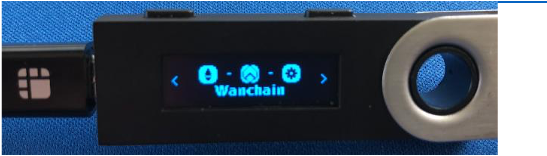

# Ledger Wallet User Guide for WAN

## Step by Step Guide

1. Install the Wanchain app via [Ledger Live](http://ledger.com/live).
2. Connect and unlock your Ledger Nano S.
3. If asked, allow the manager on your device by pressing the right button.
4. Find Ethereum in the app catalog, since the Wanchain app requires it.
5. Find Wanchain in the app catalog. (If you get an error message that the Bitcoin app is required, please install the Ethereum app. Ledger is working on fixing this.)

