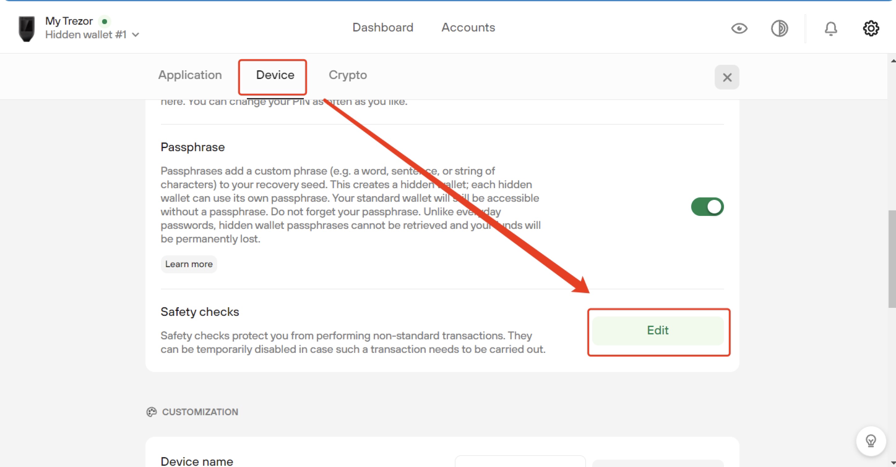
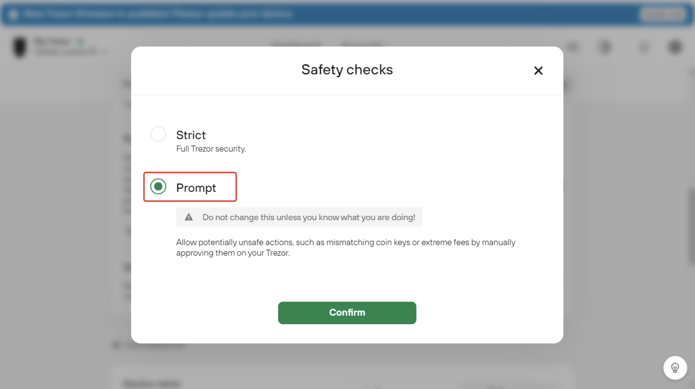
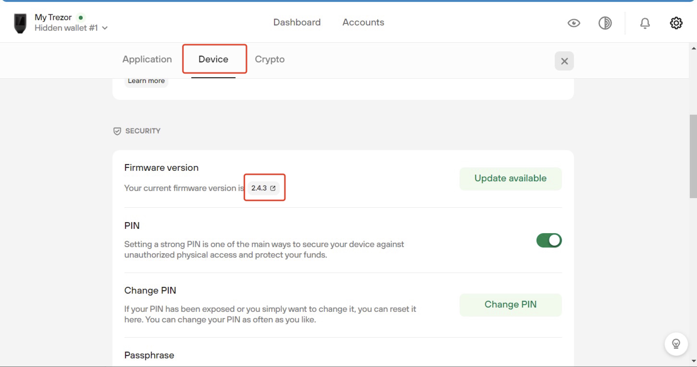

# Trezor Support

## Supported Products

Here are the Wanchain products which support WAN by using Trezor:

- [WanWallet Desktop](https://www.wanchain.org/getstarted/)
- [WanMask](https://wanmask.io/)
- [MetaMask](https://metamask.io/)
- [MyWanWallet](https://mywanwallet.com)

## Workarounds for Trezor Model T connecting to WanWallet Desktop

WanWallet desktop wallet currently does not support Trezor Model T with firmware version V2.4.3 and above. It should be noted that this is only for Trezor Model T series hardware wallets. For other Trezor series wallets, the latest version of firmware is compatible with WanWallet Desktop.

There are currently two workarounds to solve this issue: one is to switch to Prompt mode in Trezor Suite; the other is to downgrade the firmware version.

### Workaround 1: Switch to Prompt mode in Trezor Suite

Download and install Trezor Suite: https://suite.trezor.io/

Connect the Trezor Model T to the Trezor Suite, and check the firmware version.

Click the **Settings** button in the upper right corner, and click **Device** -> **Edit**

Select **Prompt** in the pop-up window and click **Confirm**. (Note that the Prompt mode will lower the level of your Trezor Model T.)

Now, WanWallet Desktop can send transactions via Trezor Model T.

**It should be noted that this switch from Strict mode to Prompt mode will weaken the security level of the hardware wallet, causing potential and unknown risks. Therefore, when you complete transactions on the Wanchain, you must immediately switch it back to the Strict mode. You should make your own judgments and bear any risks that may occur in this process.**

### Workaround 2: Downgrade the firmware version

Download and install Trezor Suite: https://suite.trezor.io/

Connect the Trezor Model T to the Trezor Suite, and check the firmware version.

Currently, WanWallet Desktop supports firmware version 2.4.2 and below.

About how to downgrade the firmware version to 2.4.2 and below, the Trezor official guide is given for reference:
https://wiki.trezor.io/Installing_custom_firmware_on_Trezor_Model_T#Trezor_Model_T_firmware_downgrade_options

## Step by Step Guide in MyWanWallet

*DISCLAIMER: MyWanWallet.com is a Wanchain community project. The Wanchain Foundation does not maintain the project or make any guarantees about its security or functionality, and takes no responsibility for any loss or damages incurred through use of MyWanWallet.com.*

1. Connect your Trezor to your PC by USB and navigate to [https://mywanwallet.com/](https://mywanwallet.com/). Double check the address to make sure that it is correct, including 'https' and the 'com' domain.  

2. Double check that you are on the Wanchain Mainnet and not on the Testnet or any other network. 

3. Select "Trezor" from the radio menu

4. Click "Connect to Trezor" 

  

5. Allow your browser to redirect you by popup to the url beginning with `https://connect.trezor.io`.

6. Wait for the page to load.

  

7. Click the blue button with the text "Allow once for this session" to allow MyWanWallet.com permission to read the public keys from your Trezor device.

  

8. Click the green button with the text "Export" to export your Trezor device's public keys to MyWanWallet.

  

9. Using the numbers displayed on your Trezor device together with the number pad displayed in your browser, input your Trezor device's passcode in order to export your public key.
  
  
   

10. Select the address with the WAN balance you would like to use, and then click the button with the text "Unlock your Wallet".
  

11. You will now be redirected to your wallet details on MyWanWallet.
  

12. Input the address you want to send to in the "To Address" field.

13. Input how many WAN you want to send in the "Amount to Send" field.

14. You may leave the "Gas Limit" at the default of 21000, and then click click the green "Generate Transaction" button to generate your transaction. 

  

15. Allow your browser to redirect you by popup to the url beginning with `https://connect.trezor.io` and wait for the page to load.
  

16. Click the blue button with the text "Allow once for this session" to allow MyWanWallet.com permission to sign the transaction with your Trezor device.

  

17. Confirm the transaction on your Trezor device by clicking the right button:

    

18. Confirm again:

    

19. You will be redirected back to the MyWanWallet page where you should click the green button with the text 'Send Transaction' to begin sending your transaction.

  

20. Finally a pop-up window will display all of your transaction details. Please check all the details to make sure they are correct, and click the green button with the text "Yes, I am sure! Make transaction." to complete your transaction.

  
  

