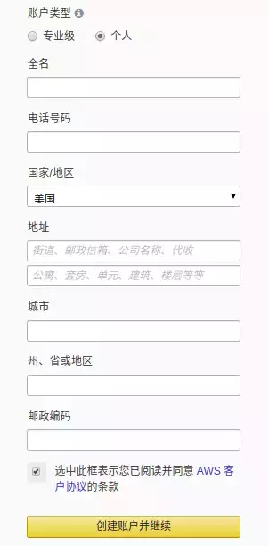
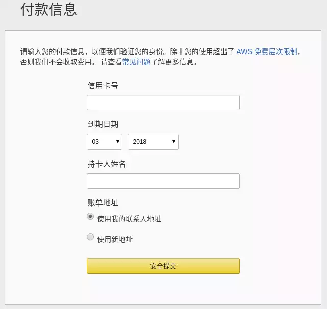

# 如何申请和创建AWS账号
### 需要预先准备

- VISA等支持AWS支付的信用卡
- 能接听电话的座机或手机号
 
### 注册AWS账号

访问亚马逊AWS官网：
https://aws.amazon.com/cn/
 
进入注册页面，填写注册信息，AWS账户名称填写拼音的姓名即可，如下图：

 
填写个人信息，需要使用拼音，地址填写信用卡的账单地址：

填写信用卡信息：

接下来系统会拨打电话给你，拨号界面上输入电脑屏幕显示的4位数字（以#结尾）即可。
 
账户创建成功，信用卡会产生1美元的交易，该交易为验证信用卡冻结资金，过一段时间会返还。
