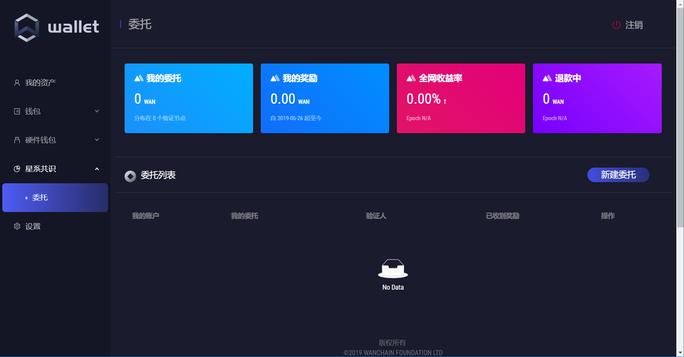
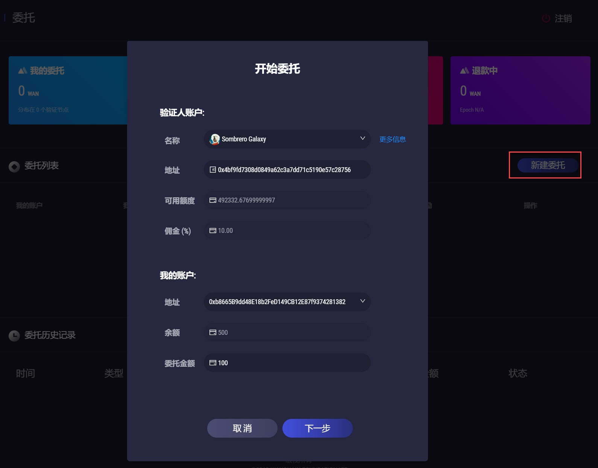
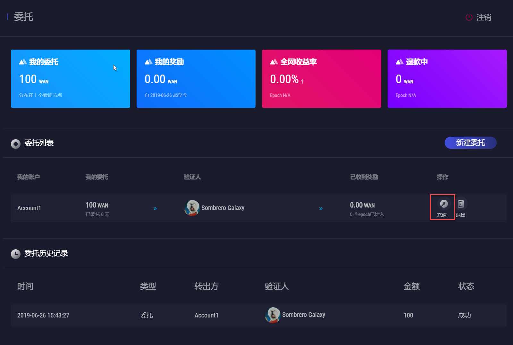
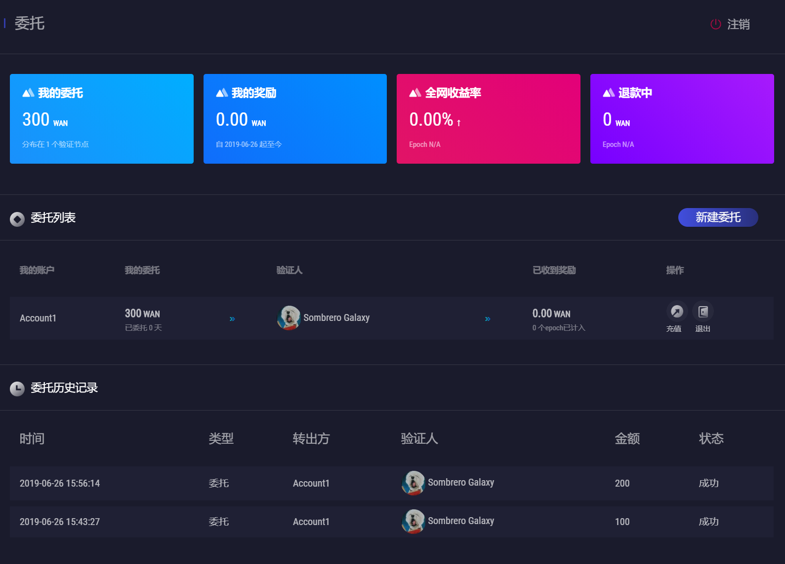

# 如何成为委托人并进行委托质押

Wanchain发布了官方轻钱包，委托人可通过钱包中的可视化界面进行委托质押。同时，用户仍可采用命令行的方式进行代币委托。

## 通过轻钱包进行委托质押

Wanchain新推出的星系共识PoS具有完整的委托机制。用户作为委托人可在全网中选择自己认可的验证节点，并将手中的代币委托给该验证节点，从而获取权益挖矿的收益。**委托最低门槛是100WAN**。

在**委托**界面中，用户可以清楚地了解到自己的**WAN委托量**、**累计奖励金额**、当前测算的**全网年化收益率**、**退款WAN代币数量**。同时，用户还可以查看自己当前的**委托列表**以及**历史委托记录**。



点击**新建委托**，在验证人账户列表中选择想要委托的**验证人名称**，在我的账户中选择要进行委托的**转出地址**，输入**委托金额**。在设置委托过程中，需要关注几个参数，验证人的**可用额度**，其数值代表该验证人最多还能接受多少的委托量；验证人的**佣金**，该数值表示委托人的最终收益是总收益扣除相应的佣金，如总收益是50WAN，佣金是15%，则委托人最终收到42.5WAN。

下图中，用户向一位验证人委托100WAN。



委托成功之后，在**我的委托**中显示100WAN的委托量；在委托列表中，便能显示该条委托记录。如果用户想追加委托资金，则可点击**充值**。



追加成功后，如下图所示：



## 通过命令行进行委托质押

#### 1）安装 docker(Ubuntu):

安装docker是为了方便的使用gwan，如果不使用docker，也可以直接下载gwan二进制文件来运行。
```
$ sudo wget -qO- https://get.docker.com/ | sh

$ sudo usermod -aG docker YourUserName

$ exit
``` 

#### 2）创建账号，查找验证节点信息。请注意，在使用pos.getStakerInfo获取验证节点信息前，请确认当前已经同步到最新块。可通过eth.blockNumber来查看。

验证节点信息可以通过命令行查找，也可以通过浏览器查找。

```
$ docker run -d -v /home/YourUserName/.wanchain:/root/.wanchain wanchain/client-go:2.1.2 /bin/gwan

YourContainerID

$ docker exec -it YourContainerID /bin/bash

root> gwan attach .wanchain/gwan.ipc

> personal.newAccount('YourPassword')

"YourAccountAddress"

> pos.getStakerInfo(eth.blockNumber)
[
  {...},
  {...},
  {  Address: "DelegateAddress",
    Amount: 2e+23,
    Clients: [],
    FeeRate: 10,
    From: "...",
    LockEpochs: 30,
    PubBn256: "...",
    PubSec256: "...",
    StakingEpoch: 117
  }
]
```

通过上述执行，得到本地账号 `YourAccountAddress` 和想要投注的具备理想委托费率`FeeRate`的验证节点地址 `DelegateAddress`。

#### 3）确保您的测试账户地址拥有足额的WAN测试币（委托人至少大于100枚）

#### 4）创建投注脚本 /home/YourUserName/.wanchain/sendDelegate.js

```
//sendDelegate.js

// If you want to send to a delegate you can modify and use this script to run.

//-------INPUT PARAMS YOU SHOULD MODIFY TO YOURS--------------------

// tranValue is the value you want to send to lock in stake, minValue is 100
var tranValue = "100000"

// delegateAddr is the validator address which accept delegator.
var delegateAddr = ""

// baseAddr is the delegator's fund source account.
var baseAddr  = ""

// passwd is the fund source account password.
var passwd    = ""

//-------INPUT PARAMS YOU SHOULD MODIFY TO YOURS--------------------


//------------------RUN CODE DO NOT MODIFY------------------
personal.unlockAccount(baseAddr, passwd)
var cscDefinition = [{"constant":false,"inputs":[{"name":"addr","type":"address"}],"name":"stakeAppend","outputs":[],"payable":true,"stateMutability":"payable","type":"function"},{"constant":false,"inputs":[{"name":"addr","type":"address"},{"name":"lockEpochs","type":"uint256"}],"name":"stakeUpdate","outputs":[],"payable":false,"stateMutability":"nonpayable","type":"function"},{"constant":false,"inputs":[{"name":"secPk","type":"bytes"},{"name":"bn256Pk","type":"bytes"},{"name":"lockEpochs","type":"uint256"},{"name":"feeRate","type":"uint256"}],"name":"stakeIn","outputs":[],"payable":true,"stateMutability":"payable","type":"function"},{"constant":false,"inputs":[{"name":"secPk","type":"bytes"},{"name":"bn256Pk","type":"bytes"},{"name":"lockEpochs","type":"uint256"},{"name":"feeRate","type":"uint256"},{"name":"maxFeeRate","type":"uint256"}],"name":"stakeRegister","outputs":[],"payable":true,"stateMutability":"payable","type":"function"},{"constant":false,"inputs":[{"name":"addr","type":"address"},{"name":"renewal","type":"bool"}],"name":"partnerIn","outputs":[],"payable":true,"stateMutability":"payable","type":"function"},{"constant":false,"inputs":[{"name":"delegateAddress","type":"address"}],"name":"delegateIn","outputs":[],"payable":true,"stateMutability":"payable","type":"function"},{"constant":false,"inputs":[{"name":"delegateAddress","type":"address"}],"name":"delegateOut","outputs":[],"payable":false,"stateMutability":"nonpayable","type":"function"},{"constant":false,"inputs":[{"name":"addr","type":"address"},{"name":"feeRate","type":"uint256"}],"name":"stakeUpdateFeeRate","outputs":[],"payable":false,"stateMutability":"nonpayable","type":"function"},{"anonymous":false,"inputs":[{"indexed":true,"name":"sender","type":"address"},{"indexed":true,"name":"posAddress","type":"address"},{"indexed":true,"name":"v","type":"uint256"},{"indexed":false,"name":"feeRate","type":"uint256"},{"indexed":false,"name":"lockEpoch","type":"uint256"},{"indexed":false,"name":"maxFeeRate","type":"uint256"}],"name":"stakeRegister","type":"event"},{"anonymous":false,"inputs":[{"indexed":true,"name":"sender","type":"address"},{"indexed":true,"name":"posAddress","type":"address"},{"indexed":true,"name":"v","type":"uint256"},{"indexed":false,"name":"feeRate","type":"uint256"},{"indexed":false,"name":"lockEpoch","type":"uint256"}],"name":"stakeIn","type":"event"},{"anonymous":false,"inputs":[{"indexed":true,"name":"sender","type":"address"},{"indexed":true,"name":"posAddress","type":"address"},{"indexed":true,"name":"v","type":"uint256"}],"name":"stakeAppend","type":"event"},{"anonymous":false,"inputs":[{"indexed":true,"name":"sender","type":"address"},{"indexed":true,"name":"posAddress","type":"address"},{"indexed":true,"name":"lockEpoch","type":"uint256"}],"name":"stakeUpdate","type":"event"},{"anonymous":false,"inputs":[{"indexed":true,"name":"sender","type":"address"},{"indexed":true,"name":"posAddress","type":"address"},{"indexed":true,"name":"v","type":"uint256"},{"indexed":false,"name":"renewal","type":"bool"}],"name":"partnerIn","type":"event"},{"anonymous":false,"inputs":[{"indexed":true,"name":"sender","type":"address"},{"indexed":true,"name":"posAddress","type":"address"},{"indexed":true,"name":"v","type":"uint256"}],"name":"delegateIn","type":"event"},{"anonymous":false,"inputs":[{"indexed":true,"name":"sender","type":"address"},{"indexed":true,"name":"posAddress","type":"address"}],"name":"delegateOut","type":"event"},{"anonymous":false,"inputs":[{"indexed":true,"name":"sender","type":"address"},{"indexed":true,"name":"posAddress","type":"address"},{"indexed":true,"name":"feeRate","type":"uint256"}],"name":"stakeUpdateFeeRate","type":"event"}];
var contractDef = eth.contract(cscDefinition);
var cscContractAddr = "0x00000000000000000000000000000000000000DA";
var coinContract = contractDef.at(cscContractAddr);

var payloadDelegate = coinContract.delegateIn.getData(delegateAddr)
var tx2 = eth.sendTransaction({from:baseAddr, to:cscContractAddr, value:web3.toWin(tranValue), data:payloadDelegate, gas: 200000, gasprice:'0x' + (200000000000).toString(16)});
console.log("tx2=" + tx2)
//------------------RUN CODE DO NOT MODIFY------------------
``` 


#### 5）在gwan中运行投注脚本，完成委托人投注。
 
```
$ docker exec -it YourContainerID /bin/bash

root> gwan attach .wanchain/gwan.ipc

> loadScript("/root/.wanchain/sendDelegate.js")
```
