# 如何创建合适的EC2虚拟机

### 创建AWS EC2实例

登录EC2控制台：
https://console.aws.amazon.com/ec2/
 
右上角选择机房位置：

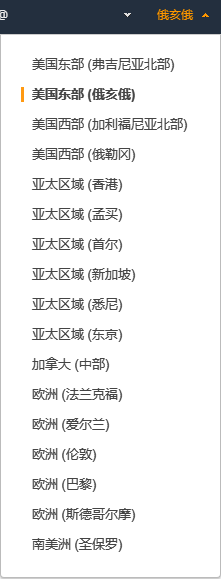
 
在网页左侧菜单找到**实例**---**实例**

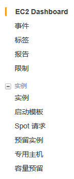

然后点击**启动实例**按钮：

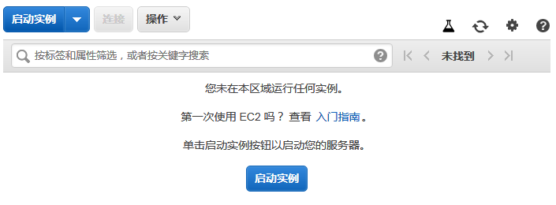

选择一个Amazon系统映像：推荐选用**Ubuntu18.04**

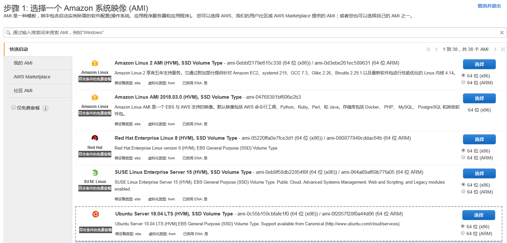
 
选择实例类型，Wanchain PoS 测试推荐**m4.large**配置

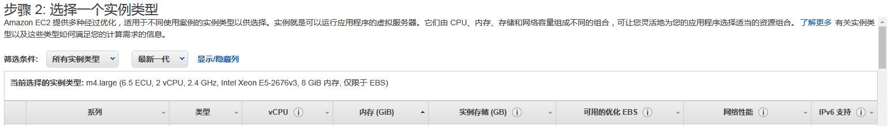

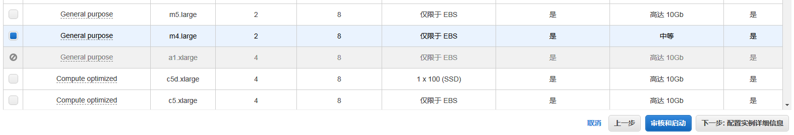

点击**下一步：配置实例详细信息**按钮
 
配置实例详细信息，默认即可：

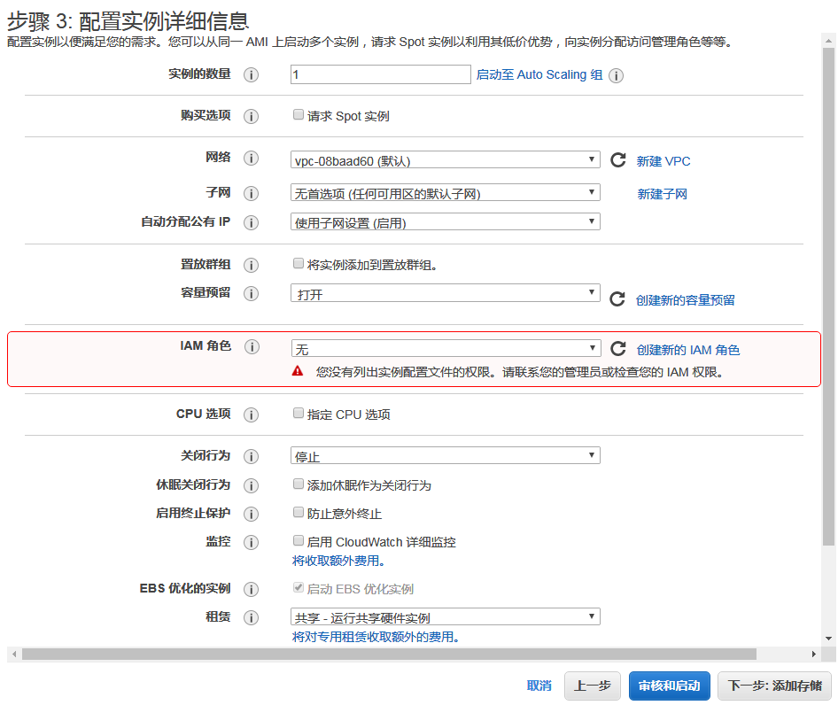

点击**下一步：添加存储**按钮

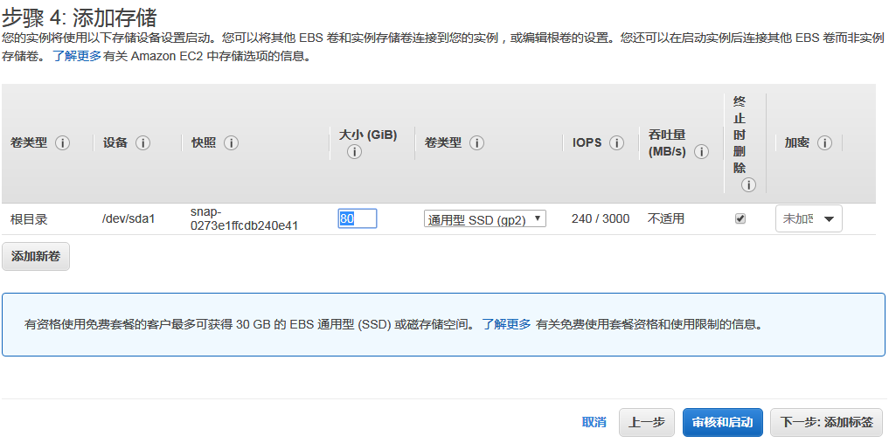

添加存储，推荐配置需要80GB，手动输入**80**

点击**下一步：添加标签**按钮添加标签以方便记忆：

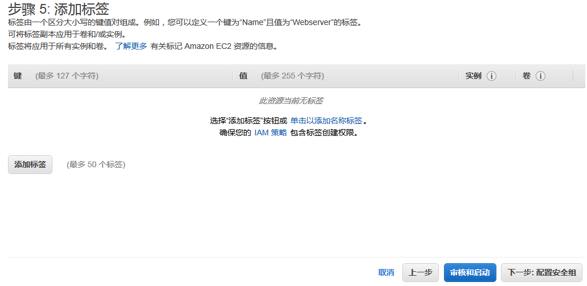
 
点击**下一步：配置安全组**按钮

添加防火墙规则：

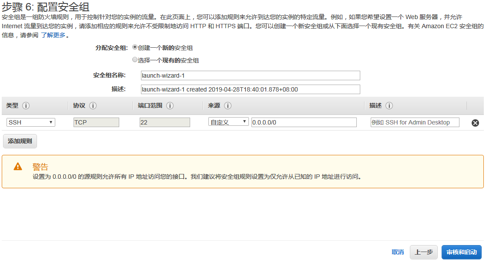

点击**审核和启动**按钮以核实实例：

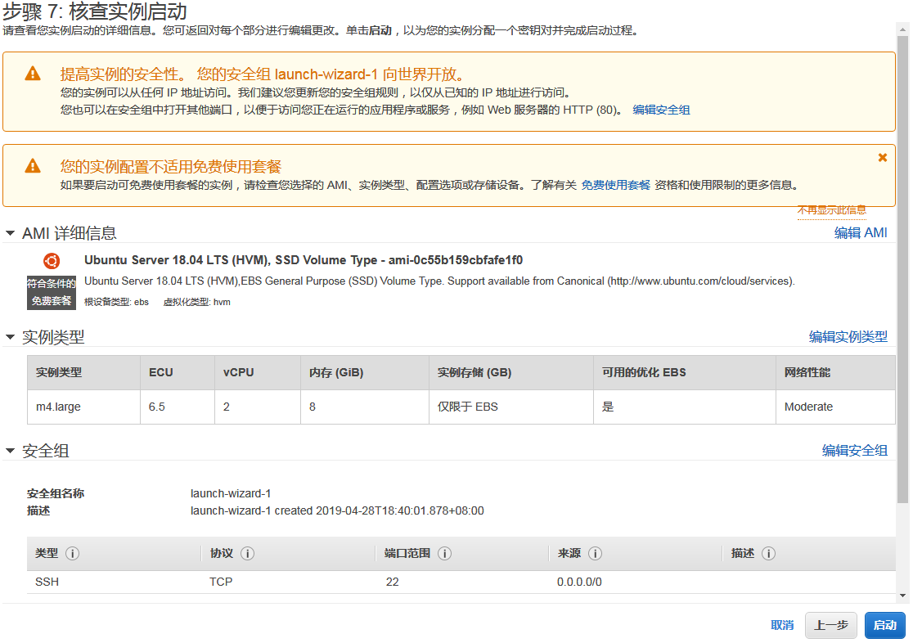

点击**启动**按钮启动实例
 
创建密钥，下载密钥对并妥善保管，SSH登录的时候要用到：

如此，一个EC2实例就创建成功了。
 
### SSH登录AWS EC2

Linux下SSH登录方法，设置密钥文件权限：
**chmod 400 aws.pem**
 
SSH登录命令：
**ssh -i aws.pem root@公有DNS (IPv4)**
 
Windows平台下PuTTy登录需要先使用PuTTyGen将.pem转换为ppk文件，在PuTTy工具的Auth选项里选择ppk文件。 
 
### 删除AWS EC2实例

首先终止实例：

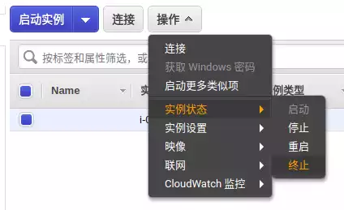

确认终止：

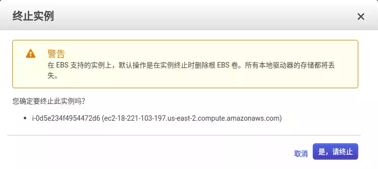
 
终止后检查一下卷有没有删除，避免产生费用。另外，终止后实例仍然会呆在列表里一段时间，一般半小时内就会彻底消失。
