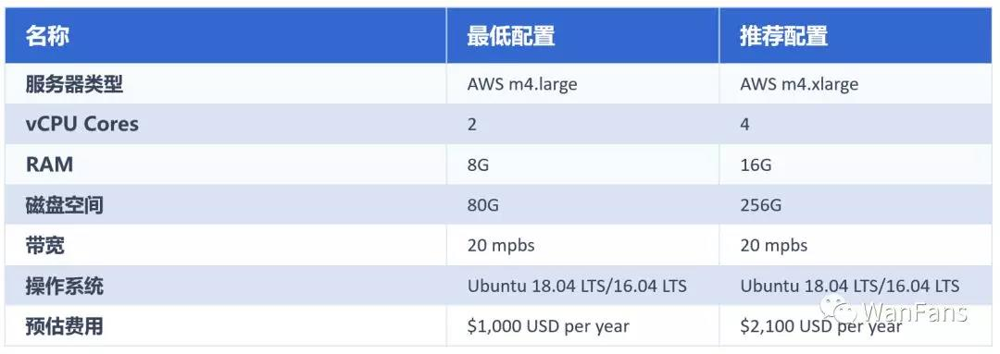

# 软硬件环境有哪些要求

### 硬件环境
此次为Beta测试，考虑到测试者的服务器成本等原因，我们不对硬件环境做过多要求。请保证使用正常硬件配置或者较高配置的服务器或个人电脑。中国境内的验证节点，请确保其网络能正常访问境外网络。

下图展示的是星系共识正式上线后，验证节点所需要的硬件要求的最低配置和推荐配置，供此次参与Beta的测试者参考。



### 软件环境
- 建议使用Linux或MacOS操作系统。
- 使用Docker运行需要安装Docker服务。
- 使用源码编译运行需要安装和配置golang运行环境：https://golang.org/
  配置环境变量 **$GOPATH** 和 **$GOROOT**
 
从github获取最新代码：

```
$ mkdir -p $GOPATH/src/github.com/wanchain/

$ cd $GOPATH/src/github.com/wanchain/

$ git clone https://github.com/wanchain/go-wanchain.git

$ cd go-wanchain

$ git checkout develop

$ git pull

$ make
``` 

编译得到的gwan在此目录下：**build/bin/gwan**
