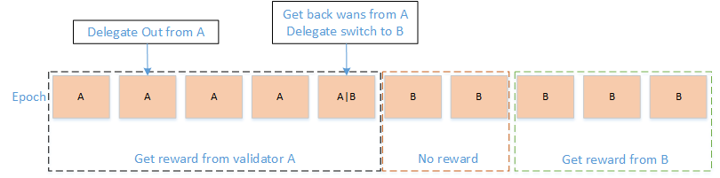
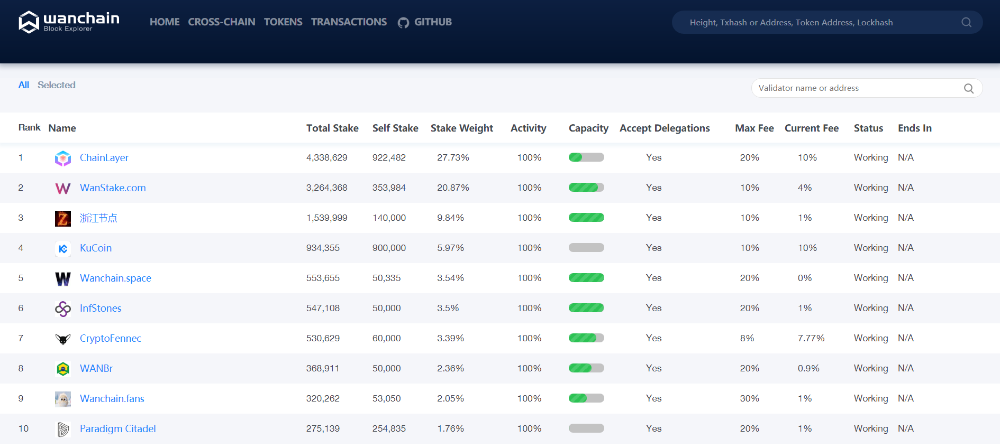

# 常见问题
### 1. 我把WAN委托给了某一验证节点，什么时候能开始获得奖励？

首先，要明确一个前提，只有当你所投的验证节点被选中进入随机数生成组（RNP组）或者出块者选择组（EL组）时，你才有奖励可获得。否则是没有奖励的。

下面举例说明正确的委托姿势：

> 请在当日早上8点前将WAN代币委托给验证节点。当日中午12点全网会选出25个验证节点放入RNP组，选出24个验证节点放入EL组。

> 如果你所投的节点被选中，恭喜你，你所在的节点会在次日上午8点开始干活。

> 如果你被选到RNP组里，则第三天中午12点，你就能收到该节点干活的属于你那部分的全部奖励；如果你被选到EL组里，则第三天中午12点和第四天中午12点，你将各收到50%的奖励。

**注：当日早上8点之后委托的，只能等到次日中午12点看自己所投的节点是否被选中。如果节点没被选中，则再等24小时，看节点是否被选中。依此类推。**

### 2. 我作为委托人退出了某一验证节点，我的WAN什么时候到账？

每天早上8点是个分水岭：8点前退出（无限接近8点），最快可在52小时内到账；8点后退出（无限接近8点），最慢在76小时内到账。

在退出的52至76小时内，如果该节点有奖励发放，你同样能获得奖励相应的比例。

具体原因，请咀嚼如下每一轮验证节点选举的机制图

### 3. 我把WAN委托给某一验证节点后，奖励是如何计算的？

首先强调一点，只有当你所在的验证节点被选中了，你作为委托人才会跟着有奖励入账，如果验证节点没被选中，你作为委托人在当前这一轮中也是没有奖励的。

但同时要强调另一点，如果我所在的验证节点总质押量少，那么节点被选中的概率也小，是不是意味着我作为委托人奖励也不及我委托给其他节点多？答案是否定的。你委托给大额节点，选中概率高，但单次发放到你手中的奖励会较少；你委托给小额节点，选中概率低，但单次发放到你手中的奖励会较多。所以，把时间轴拉长，作为委托人，只要你所投的验证节点的质押周期恒定，在线活性恒定，那么你获得的奖励基本是一样的。

Wanchain第一年会发放250万WAN的PoS奖励（这个不是增发的，是预留的WAN），所以每天发放6850WAN。这6850WAN每天中午12点会发放给49个验证节点（25个RNP和24个EL）以及委托在验证节点之上的委托人。每个验证节点和该节点的委托人总共能获得139WAN。如果该验证节点质押周期是90天且节点和委托人相同质押量下，节点本身拿到的奖励是委托人的1.5倍。

举例说明：A验证节点自质押了50000WAN，质押周期90天，委托费率为0，你作为委托人委托给A节点50000WAN且A节点上只有你一个人委托。那么，若某一轮A节点被选中，则该轮中，A节点将拿到约139\*1.5/(1.5+1)=83WAN，你将拿到约139\*1/(1.5+1)=55WAN。

### 4. 委托资金安全么？

委托到验证节点上的资金绝对安全。只有委托人自己掌握委托资金的私钥，验证节点触碰不到委托人的资金。委托资金的奖励和本金返还完全由PoS智能合约代码控制，验证节点就算跑路也拿不走委托进来的本金和产生的奖励。

### 5. 这么多验证节点，我该选择哪个节点？

从数学角度来讲，不管选择投哪个验证节点，只要你所投的验证节点的质押周期恒定，在线活性恒定，那么把时间跨度拉长，你所获得的奖励基本是一样的。所不同的是，你委托给大额节点，选中概率高，但单次发放到你手中的奖励会较少；你委托给小额节点，选中概率低，但单次发放到你手中的奖励会较多。

你需要真正关心的验证节点的两个重要参数是质押周期和在线活性。在线活性意味着这个节点的网络是否稳定，该轮到这个节点干活的时候是否在干活。如果活性低，则你的收益也会降低。节点的活性哪里可以查到？通过Wanchain官方浏览器，如下图Activity列，100%表示该节点活性满分。

 

### 6. 我通过官方轻钱包将WAN委托给某一节点，为什么总是提示委托失败？

委托的过程也是需要消耗Gas费的，请不要把你的委托地址上的WAN全部委托给验证节点，至少要保留一点余额（0.1WAN以内便可）作为Gas费。

如果验证节点的委托额度已经满了（委托额度=验证节点自有本金\*10），你也无法进行委托。

### 7. 我是验证节点，我的节点明明正常运营，而且也被选中了，为何收不到奖励？

请检查你的验证节点账户余额是否为0（非发起验证节点注册及获取奖励的地址，而是验证节点本身的地址）。为保证正常履行PoS共识分配的任务，以及相应收益的正常发放，验证节点账户需要留有一定资金，用于被PoS共识选中时履行PoS任务所需的Gas费。请往自己的验证节点地址上普通转账5-10WAN（不是质押5-10WAN！），并定期检查余额是否为零。

