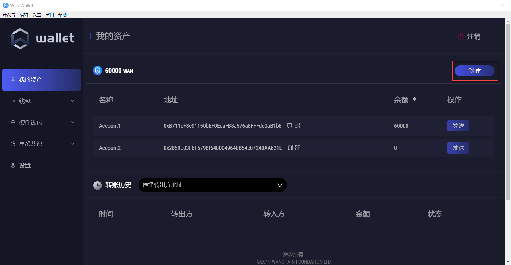
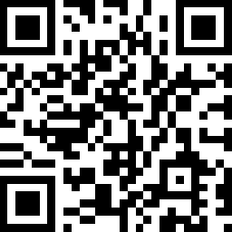
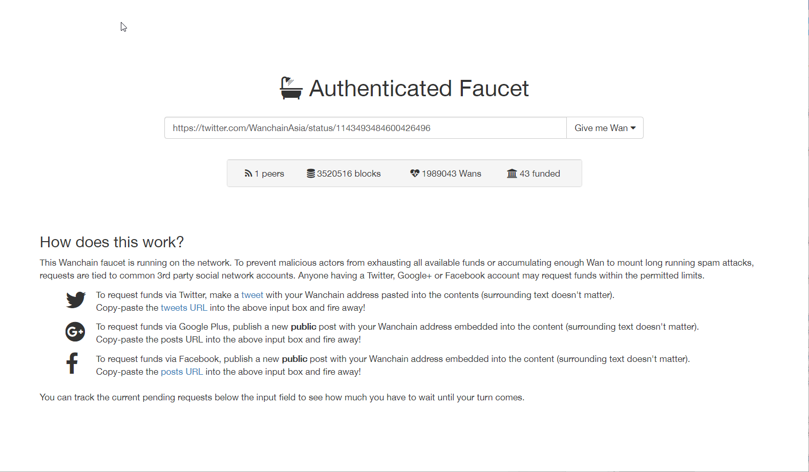

# 如何申请加入Beta测试，如何申请WAN测试币

### 下载Wan Wallet轻钱包，创建可接收WAN测试币的地址

请下载[Wan Wallet（Beta版）轻钱包](https://github.com/wanchain/wan-wallet-desktop/releases)。**注意，目前Wan Wallet轻钱包只支持测试币，请勿将主网WAN代币转入此钱包。**

完成Wan Wallet安装后，在**钱包->WAN**目录下，点击**新建**便可方便创建一个新地址。该地址便可用于接收Beta版测试币。

除了使用钱包创建地址，您也可以采用命令行方式生成地址，用于接收测试币。具体方法详见[如何创建成为验证节点](node_setup.md)中的使用docker中的gwan创建keystore账号部分。

### 填写Beta测试申请表，提交用于接收WAN测试币的地址

有意向参与Beta测试的参与者请访问此链接填写Beta测试申请表：
http://wanchain.mikecrm.com/USjDMuk

或扫描如下二维码填写申请表：

收到申请后，我们将向申请者的Wan地址随机分配50,000WAN 至150,000WAN 不等的大额度WAN代币。
 
对于只做委托测试的小额度用户，可直接通过我们提供的Faucet测试币申请网站进行申请。同申请以太坊测试币类似，测试者需将待接收WAN测试币的地址通过Twitter或其他Faucet支持的社交媒体账号推送出去，并将推文地址放入输入框，便可每日申请200个WAN测试币。

Faucet地址：http://54.201.62.90/

**注：对于已参加Alpha测试的用户，由于Alpha版和Beta版是两个独立的网络，所以须重新申请测试币，重新创建节点。**
