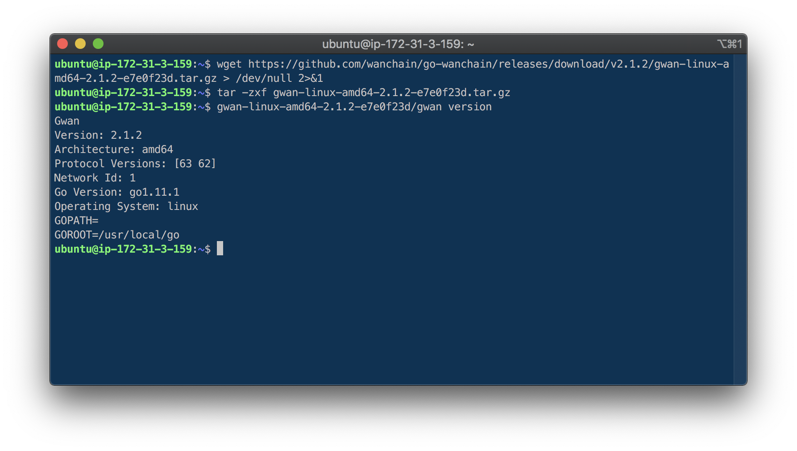
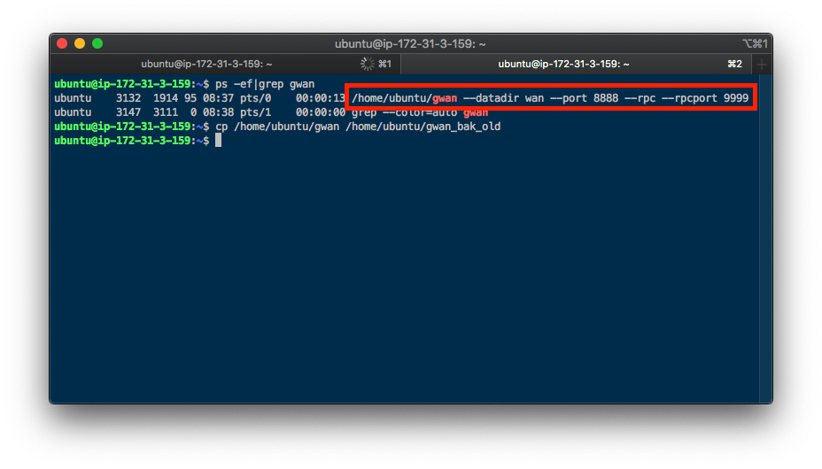
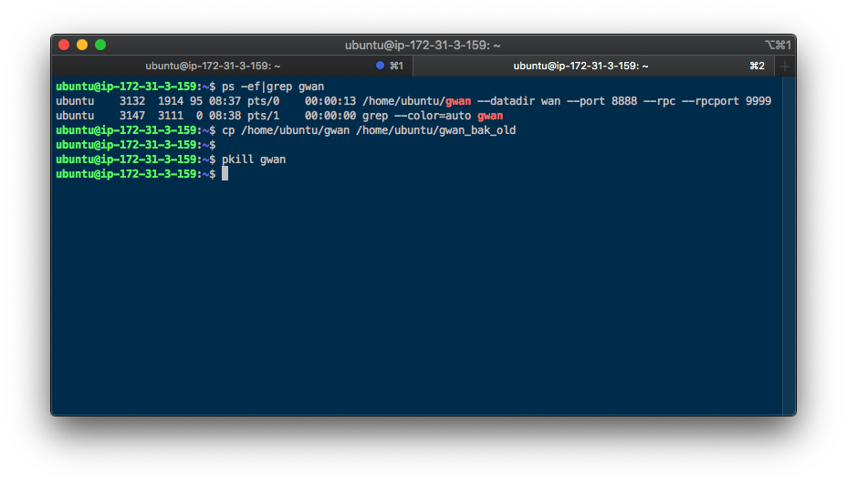
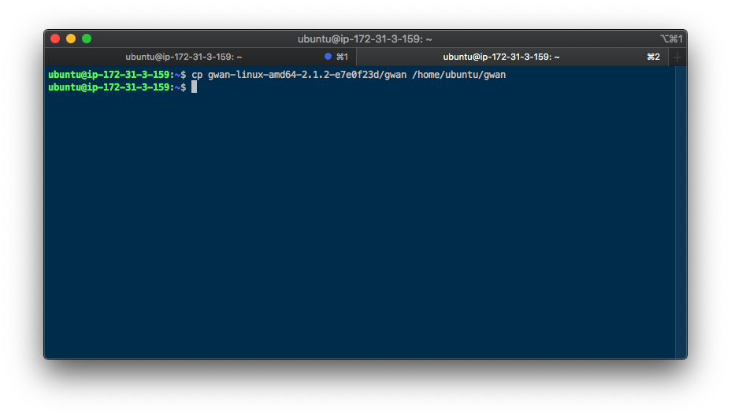
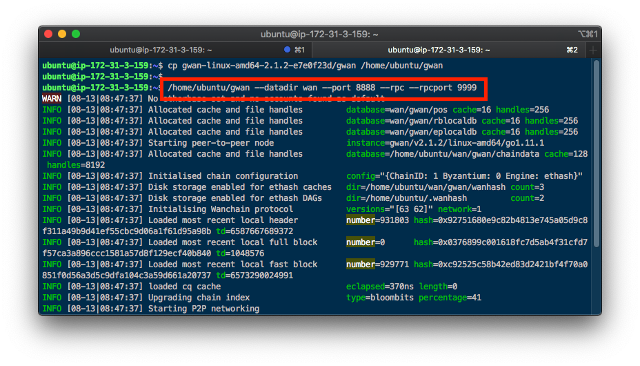

# Wanchain 客户端节点升级指南

2019年8月12日，Wanchain客户端gwan发布了支持主网POS星系共识的最新版本。根据预置代码，Wanchain主网将在区块高度为4046000的区块上进行硬分叉，完成由PoW共识到PoS共识的切换。**请务必尽快进行Gwan的升级，否则，届时未升级的gwan节点将无法正常同步新共识下的区块。**

最新的gwan版本号为：`v2.1.2`

下载地址为：https://github.com/wanchain/go-wanchain/releases/tag/v2.1.2

下载完成后可使用如下命令验证版本号是否正确：
```
$ ./gwan version
```

新版本gwan完全兼容老版本的链数据，因此可以直接用新版本gwan替换老版本gwan实现平滑升级。

下面对操作步骤进行简要说明：

### 1. 下载最新gwan节点

登录网页 https://github.com/wanchain/go-wanchain/releases/tag/v2.1.2 选则与本地操作系统相匹配的版本下载

解压缩后，使用`./gwan version`命令查询确认版本号


### 2. 备份旧节点

通过命令行方式备份旧版本gwan的命令行启动参数和gwan文件


### 3. 停止旧版本Gwan节点运行

通过命令行方式停止旧版本gwan进程
```
$ pkill gwan
```



### 4. 使用新版本gwan节点替换旧版本gwan节点

使用新版本gwan文件替换老版本gwan文件



### 5. 使用新版本gwan启动

使用原有的启动方式和启动参数启动新版本gwan

查看gwan日志，是否可以正常启动并同步新块

至此升级完成。


