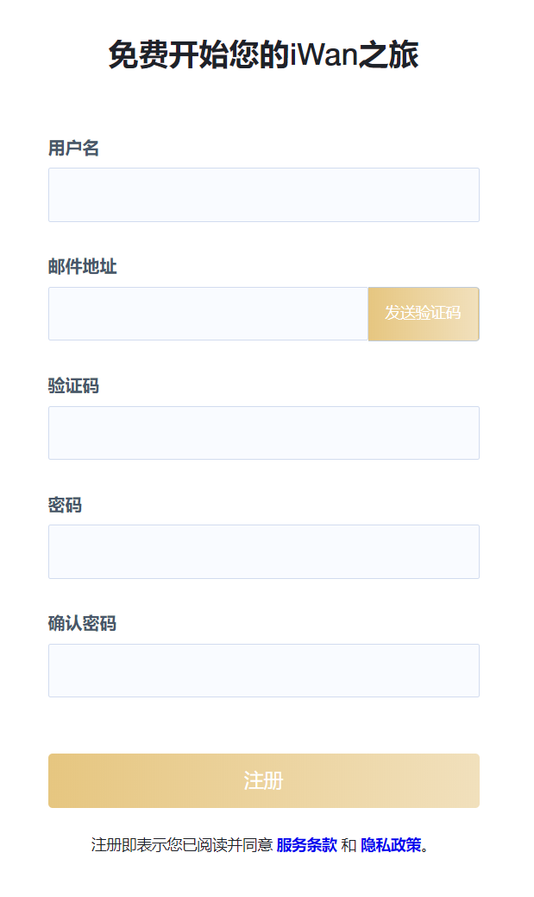
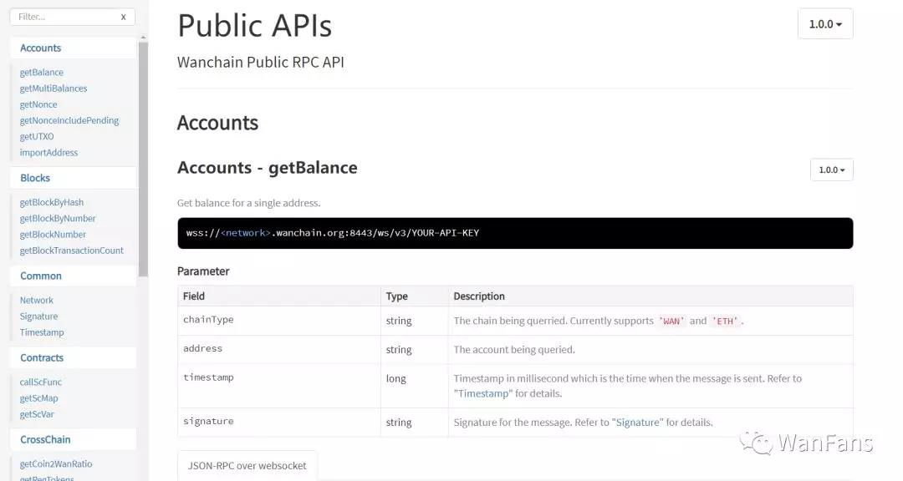
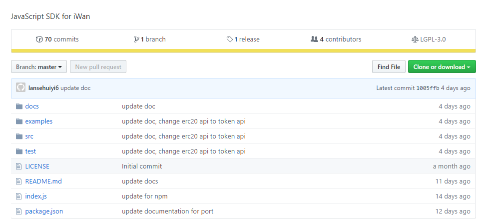
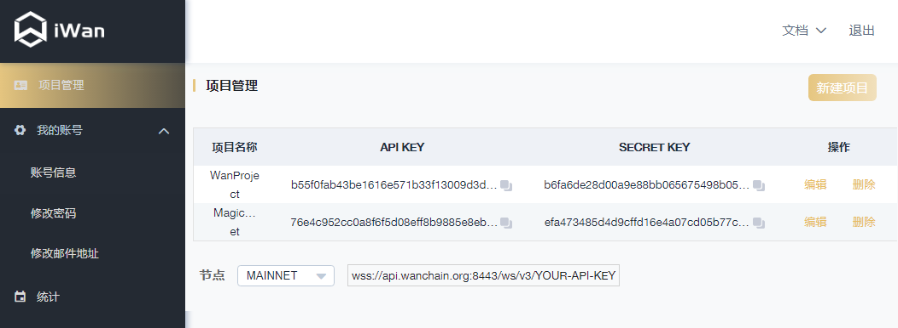
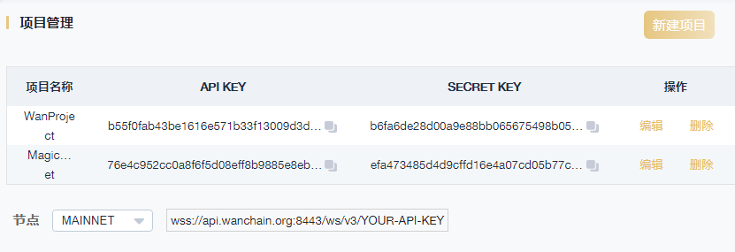
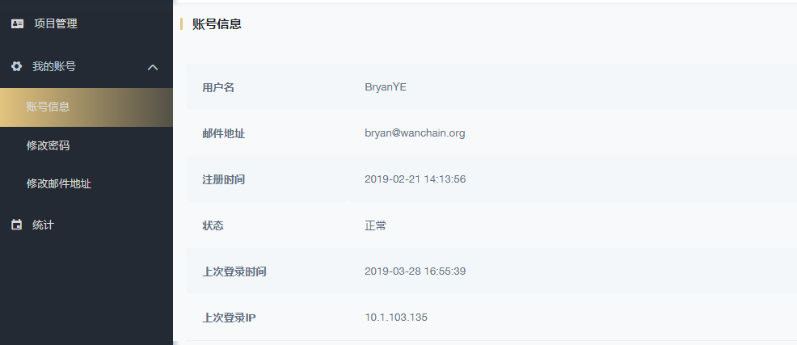
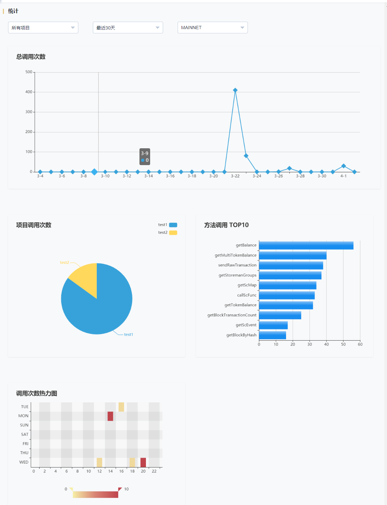

# iWan

### 什么是iWan？
 
iWan即“interface to Wanchain”，旨在为用户提供安全、便捷、开放、稳定的Wanchain（万维链）网络全节点服务，包括Wanchain主网和测试网。通过iWan提供的API和开发工具，用户能够获得Wanchain链上信息的查询服务以及跨链交易服务。iWan为用户搭建好了底层平台，用户能够把精力完全放在业务层上，专注如何开发符合自己工程需要的去中心化应用。
 
### 为什么选择iWan？
 
- 无需自行维护节点：用户不必安装、配置和维护昂贵的区块链基础设施。
- 可靠、快速部署：我们的RPC服务器提供业界顶尖的可靠性，帮助用户快速部署应用。
- 跨链能力：iWan提供了无缝调用跨链的能力，无需管理不同区块链的基础架构。
 
### 如何申请iWan账户?
 
申请iWan账户非常简单。用户访问[iWan注册页面](https://iwan.wanchain.org/register)，根据页面提示填写相关信息即可完成免费注册。目前，iWan全部接口已向公众开放。开发人员注册成功后，便能获得iWan上的全部服务。
 
注：Beta版本已经平滑过渡到了正式版本，已注册Beta版本的用户可以直接登录正式版。

### 如何使用iWan？

iWan提供了全面而丰富的Wanchain平台API接口在线文档和开发工具包SDK，功能多样、开发便捷、易于扩展，能够帮助开发人员根据自身业务需求快速构建去中心化应用。
 
用户通过首页的**文档->API**获取完整的API接口列表，以及每个对象的属性、方法、事件的详细信息。同时在线文档提供接口索引，方便参考信息的查找。

用户通过**文档->SDK**获取完整的iWan开发工具包，并通过NPM或Yarn安装类库。本地安装成功后，开发人员就能够通过iWan SDK与iWan的RPC服务器进行通信，调取相关服务。

Wanchain团队采用JSON RPC标准和Web Socket向开发人员提供接口和服务，用户完全可以选择自己擅长的类库和开发框架进行开发。调用API接口是目前在Wanchain平台上开发应用性价比最高的方式。用户既能享受iWan提供的请求服务，同时也能获取跨链交易服务。目前，Wanchain已支持BTC，ETH和多种ERC20通证（MKR，Dai，LINK，LRC，GUSD， USDC等）相互之间的跨链交易能力。

通过应用向iWan发送服务请求，用户能够获取无差别的区块链服务，这便意味着用户可以把更多的精力集中在业务应用的开发上。
 
目前，iWan支持了[JavaScript的SDK](https://github.com/wanchain/iWan-js-sdk)，后续我们将根据市场需求和反馈，提供更多语言的SDK供开发人员选择和使用。
 
### 如何使用账户管理页
 
用户登录注册的账户后，便进入到账户管理页面。在账户管理页，我们提供了**项目管理**、**账号管理**和**统计管理**三大版块。

在项目管理版块，单个账户可在iWan中创建多个项目。新建项目时，会同时生成一对API Key和Secret Key。这一对Key用于验证用户今后对iWan的访问。
 
用户能够通过API Key生成iWan服务接入点URL，如wss://api.wanchain.org:8443/ws/v3/YOUR-API-KEY。即便API Key遭泄漏或被盗取，用户仍因为通过Secret Key对服务请求进行了加密签名，从而保障了服务访问的安全。用户通过API Key获取访问iWan API服务的权限，通过Secret Key用于消息签名。用户发起的每一次请求都会关联一个递增的ID值，永不重复，用来防止黑客截取之前的请求URL而轻松盗取访问内容。除了ID值的唯一性，请求URL还可以关联时间戳信息，因此我们建议用户通过接口获取毫秒级或更高精度的时间戳服务，将其关联至URL，从而双重保障URL的安全。
 
iWan同时提供了主网服务接入点和测试网服务接入点，用户根据需要可自主选择。

在账户管理版块，我们提供了账号基本信息管理、密码修改和邮箱地址修改的功能。

在统计管理版块，我们提供了可视化统计图功能。用户应用与iWan的历史交互数据将以图表的方式进行呈现，统计结果更加直观高效。

iWan对主网和测试网都提供了对应的统计功能，自动生成历史访问量的统计图。用户可以统计全部项目，也可以选择具体某个项目进行统计。统计的数据包括总调用次数、单个项目调用次数、方法调用排名、调用次数热力图等。
 
未来，我们将提供更多有关iWan的统计数据，比如跨链交易、Storeman Group、接入点反馈等数据统计。

欢迎访问[iWan主页](https://iwan.wanchain.org/)。您可根据自己的习惯自由切换页面显示语言，目前支持中文和英文。

在使用iWan过程中如有任何疑问，请随时联系我们的技术支持：techsupport@wanchain.org
