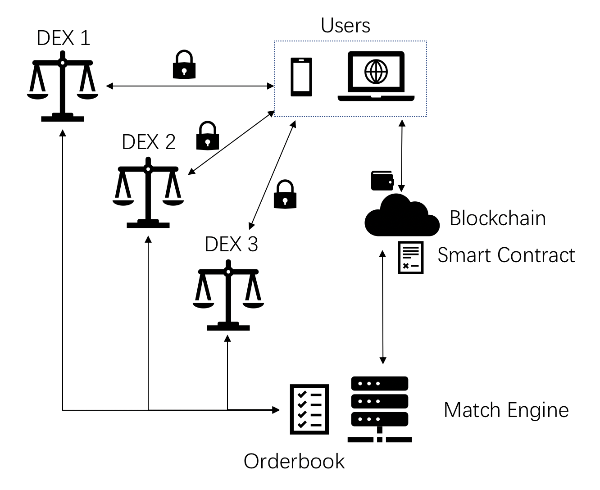
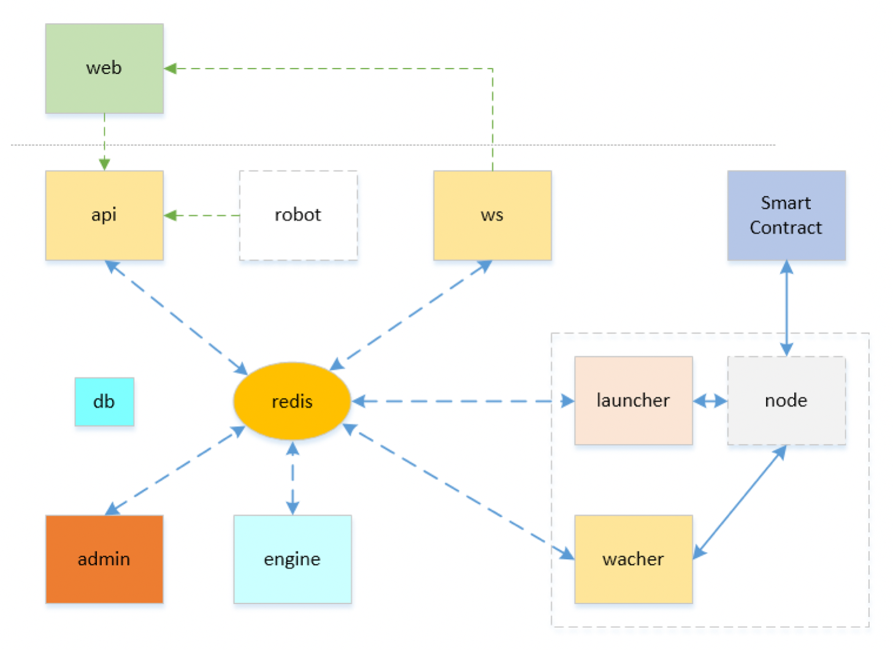

# Wan DEX介绍

WanDex是Wanchain社区开发的基于链下撮合链上结算原理的去中心化交易所框架。

它为Wanchain跨链后的资产提供了一个消费场所，为全球首个跨链的DEX平台。

可支持多个主流币种的跨链交易，如BTC、ETH、EOS和其主链上的各种ERC20标准代币。

开发者和运行商可基于此框架构在Wanchain上方便自由的创建自己的DEX。

基于开源的前端代码任意改造自己的DEX呈现，添加任何优惠策略和其它有趣的元素。

多个DEX之间可以彼此共享相同交易对的订单薄资源。

不同DEX之间可独立拥有自己的特色交易对。

Wan DEX主要组成部分可分为3部分：

- 完全开源的[前端代码](https://github.com/wandevs/dex-front-end)
- 完全开源的[智能合约代码](https://github.com/wandevs/dex-smart-contract)
- 开源社区的[链下撮合引擎](https://demodex.wandevs.org:43001/)

其工作模式与合作方式如下图所示：

用户资产掌控在用户自己的区块链钱包中，随时可在链上查询。

不同的DEX运营商基于开源前端代码改造自己的多平台页面或APP，供用户浏览和下单。

订单在撮合引擎中撮合完成后，在链上的智能合约中进行结算。

只有用户签名授权的订单才会在结算时完成资产转移。

不同的DEX可享有独立的交易对、手续费和共享的订单薄。

其API采用restful模式，实时变化的信息采用WebSocket接口主动通知。

后端技术框架如下图所示：

