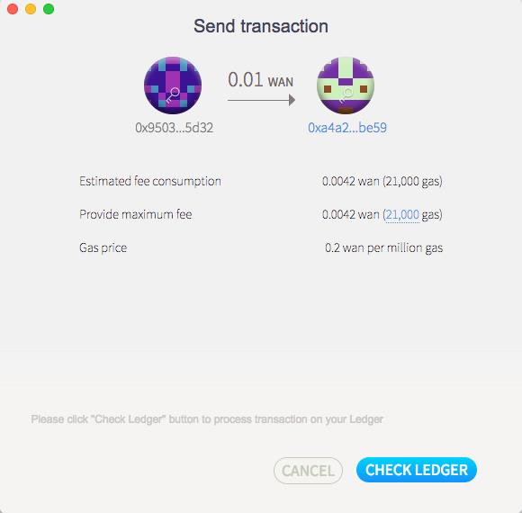

# Ledger Support
## Requirements
|**Software/Hardware**|**Version**|
|:---|:---| 
| [Wanchain GUI wallet](https://wanchain.org/products) | 1.0.5 or later  |
| [Gwan](https://github.com/wanchain/go-wanchain) |   1.0.5 or later| 
|  [Ledger](https://www.ledger.com/) |  Ledger Nano S |  
|  [Ledger Live](https://www.ledger.com/pages/ledger-live) |  1.1.4 or later  |   

## Step by step guide

1. Install the Wanchain app via
[Ledger Live](http://ledger.com/live)

2. Connect and unlock your
Ledger Nano S.

3. If asked, allow the manager
on your device by pressing
the right button.

4. Find Ethereum in the app
catalog, since the Wanchain app
requires it.

5. Find Wanchain in the 
catalog. (If you get an error
message that the Bitcoin app is
required, please install the
Ethereum app. Ledger is
working on fixing this.) 

  

6. Click Install. An installation
window will appear, your device will
display “Processing…”, then the app
installation will be confirmed.

  

7. Open the Wanchain GUI wallet
The GUI wallet should indicate
“Ledger Account Connected” and
display accounts associated with the
connected Ledger device. 

8. Send WAN  
When sending WAN from a Ledger account, first click the “Transfer” button for the
Ledger account you want to send from, then enter the recipient address, transfer
amount, and the transaction fee. When all fields have been completed and verified,
click “SEND”.  

  
  

9. Confirm transaction
Click “CHECK LEDGER” to send
the transaction information to
the Ledger device.   

    

10. Confirm the amount using the Ledger device.  

  

11. Confirm the transaction details using the Ledger device.  

  

12. Check transaction details
After the transaction has been
successfully confirmed, the
GUI wallet will redirect to the
account details view where
the transaction information
will be displayed.

  