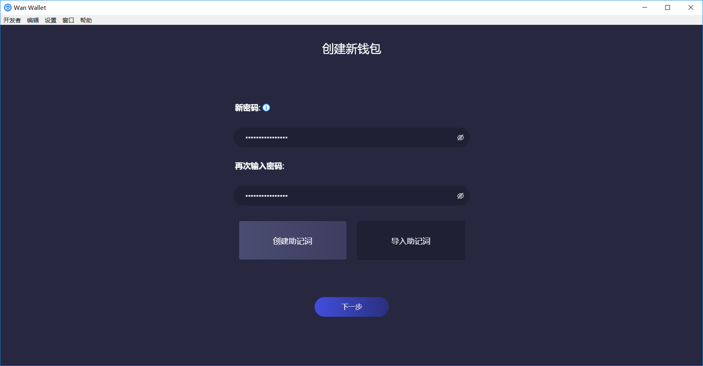
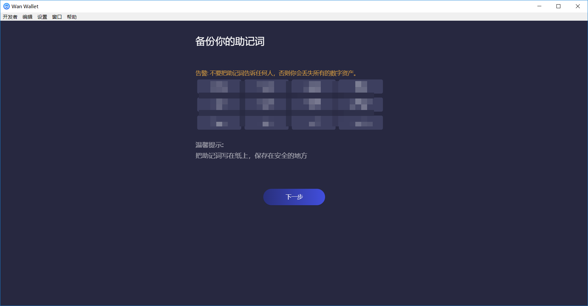
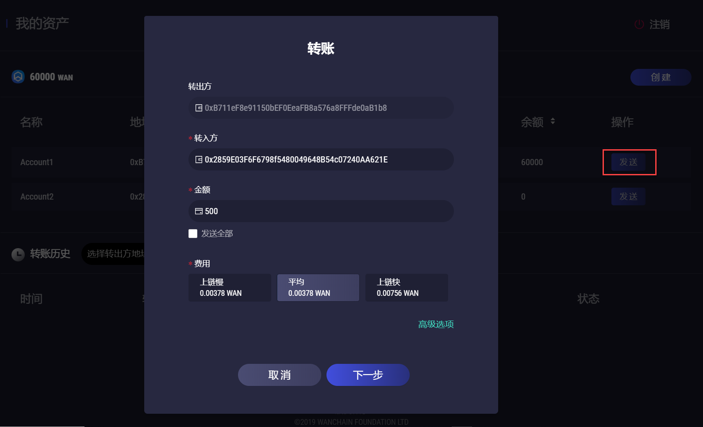
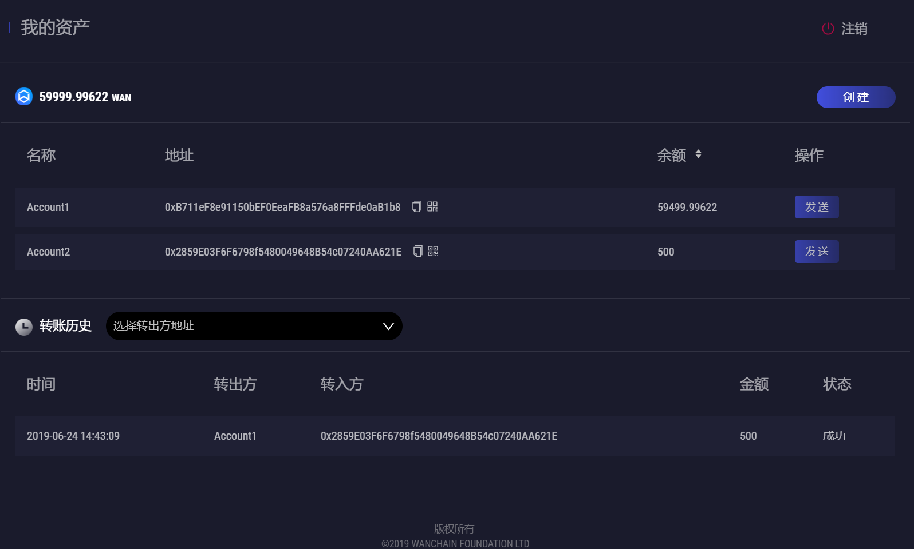
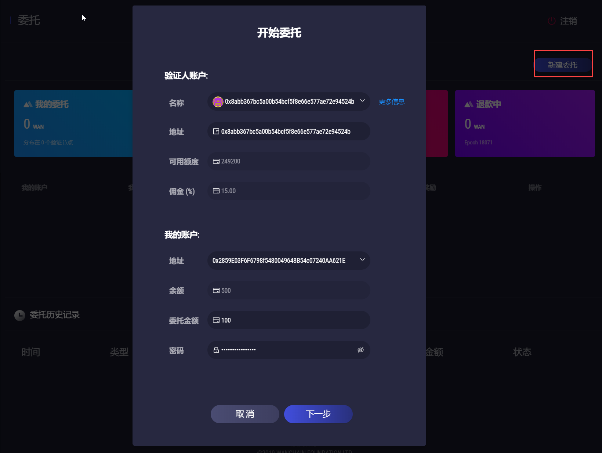
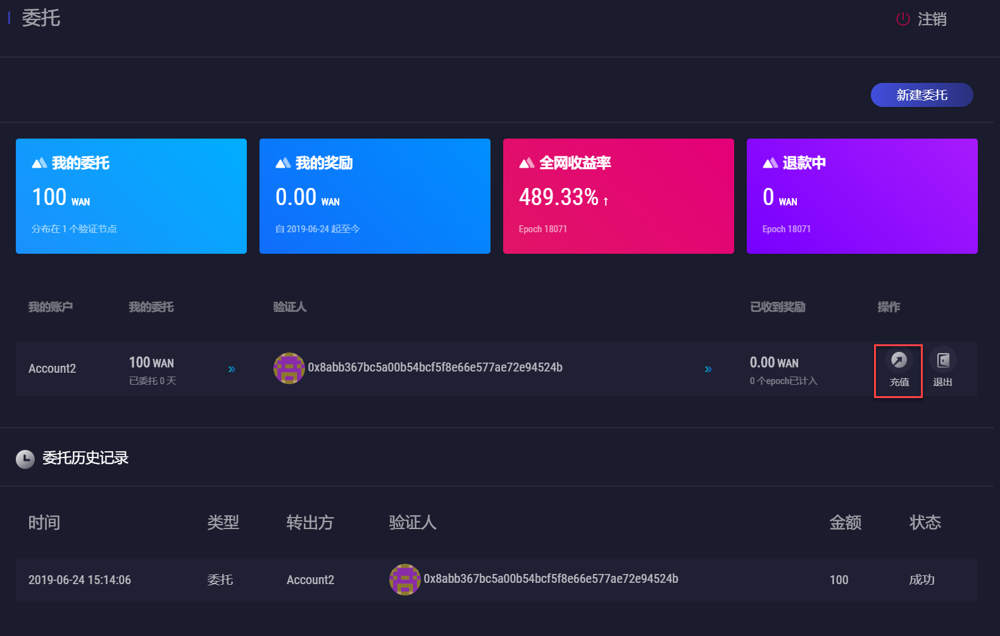
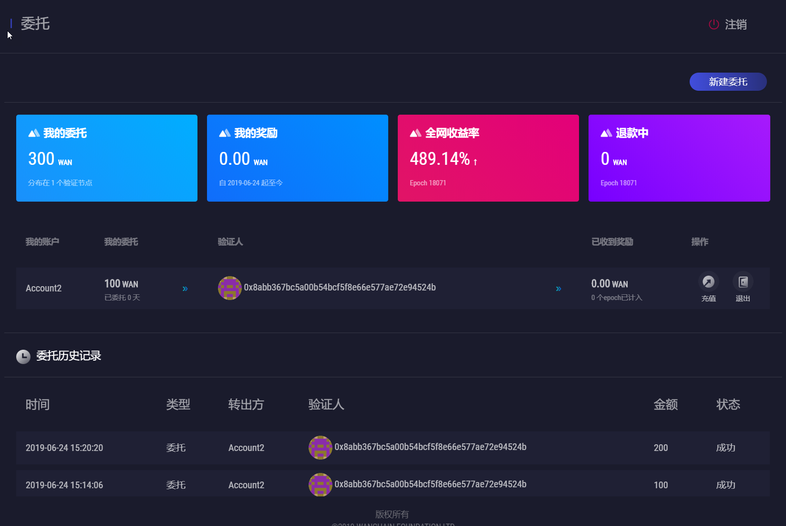
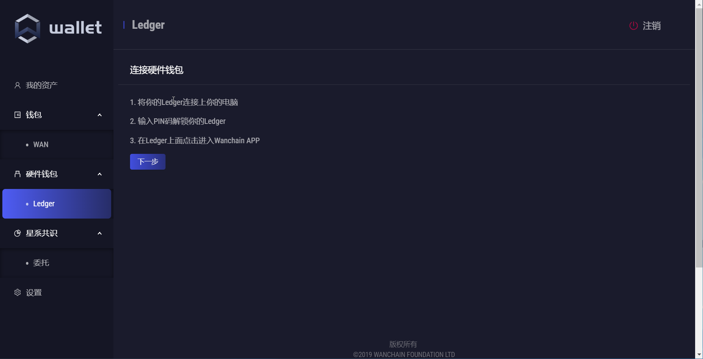
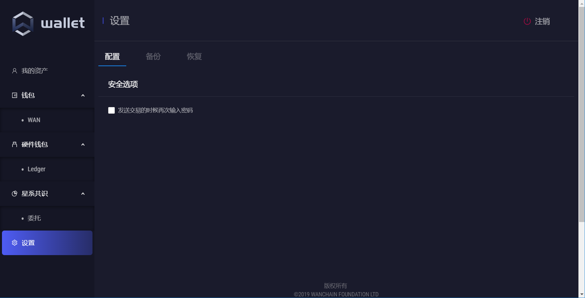

# Wan Wallet官方轻钱包使用指南（推荐）

## 0. 功能与亮点

**Wan Wallet是Wanchain官方发布的首个轻节点钱包，此次发布同时提供Mac、Windows和Linux版本的安装包。目前主要功能包括：**

- **支持WAN资产管理**
- **支持普通转账**
- **支持星系共识中委托人的委托参与和管理**
- **支持硬件钱包Ledger**
 
## 1. 下载与安装

请通过如下地址下载Wan Wallet：
https://www.wanchain.org/zh/getstarted/

双击安装包，根据提示一步步完成安装即可。
 
## 2. 注册新账户

首次打开Wan Wallet时，需要注册一个新账户。根据界面提示，设置**密码**：

 

备份和确认助记词。请注意：**一定要备份助记词，不要截屏或拍照，建议手抄下来，不要暴露给第三方**。
 

点击**下一步**，完成新账户注册。
 
## 3. 新建地址
 
Wan Wallet钱包允许在一个账户下创建多个地址。
 
在**钱包**->**WAN**目录下，点击**新建**便可方便创建一个新地址。

下图创建了两个新地址，Account1和Account2，并在Account1中存入60000WAN。地址名称可随意修改。

 

## 4. 普通转账

点击发送，输入转入方地址和转账金额，选择手续费用，完成转账交易。可在高级选项中设置更多的参数值。

下图中，Account1地址向Account2地址转账500WAN。

## 5. 委托质押
 
Wanchain新推出的星系共识PoS具有完整的委托机制。用户作为委托人可在全网中选择自己认可的验证节点，并将手中的代币委托给该验证节点，从而获取权益挖矿的收益。**委托最低门槛是100WAN**。
 
在**委托**界面中，用户可以清楚地了解到自己的**WAN委托量**、**累计奖励金额**、当前测算的**全网年化收益率**、**退款WAN代币数量**。同时，用户还可以查看自己当前的**委托列表**以及**历史委托记录**。

点击**新建委托**，在验证人账户列表中选择想要委托的**验证人名称**，在我的账户中选择要进行委托的**转出地址**，输入**委托金额**。在设置委托过程中，需要关注几个参数，验证人的**可用额度**，其数值代表该验证人最多还能接受多少的委托量；验证人的**佣金**，该数值表示委托人的最终收益是总收益扣除相应的佣金，如总收益是50WAN，佣金是15%，则委托人最终收到42.5WAN。
 
下图中，某用户向验证节点委托100WAN。

 
委托成功之后，在**我的委托**中显示100WAN的委托量；在委托列表中，便能显示该条委托记录。如果用户想追加委托资金，则可点击**充值**。

 
追加成功后，如下图所示：
 

 
## 6. 连接硬件钱包

待Wanchain主网的共识机制正式切换至PoS星系共识后，Wan Wallet将支持硬件钱包**Ledger**的接入。

注：当前Beta测试版环境下，连接Ledger的功能不可用。

 
## 7. 备份和恢复助记词

在**设置**中，目前提供三部分功能：
在**配置**栏中，对**发送交易的时候再次输入密码**勾选，则每次交易都会被要求再次输入密码，从而提高资金的安全性。
在**备份栏**中，可对助记词进行备份。
在**恢复栏**中，可对助记词进行恢复。

 
## 8. 支持多语言

通过**设置**->**语言**，用户便可方便切换钱包的界面语言，切换过程无须关闭钱包再重启。

未来，我们会支持逐步支持法语、西班牙语、日语、韩语等全球主流国家的语言。

感谢您下载并使用Wan Wallet。如您有任何疑问，可发送邮件到techsupport@wanchain.org，或者直接在我们的微信群、电报群反馈。
 
Wanchain感谢您的支持！
